import PostNav from '@rocketseat/gatsby-theme-docs/src/components/Docs/PostNav'

## Flutterで始めるアプリ開発

Flutterを使うことで、**誰でも簡単にiOS/Android/Webアプリを開発**ができます ✨  
できるだけ**分かりやすく簡単にFlutterの入門に必要な情報を紹介**していきます 💪💪

### 対象者

- アプリを作ってみたいけど、**どうやって作るか分からない方** 😕
- iOS/Androidのアプリ開発が**難しすぎて挫折してしまった方** 😨
- Flutterを使って**簡単にアプリを作れるようになりたい方** 😆
- などなど

### ゴール

- ✨ **FlutterとFirebaseを組み合わせたアプリ開発ができる状態**になる
- ✨ 作成したアプリを**自分のWebアプリとして公開**する

### 進め方

**順番に1〜7のコンテンツを進めてもらう**だけでOK 👍

1. Flutterとは
1. Flutterを使ってみる
1. Widgetを使ってみる
1. Todoアプリを作ってみる
1. Firebaseとは
1. Firebaseを使ったアプリ
1. Webアプリ公開

### 更にレベルアップしたい方

Zennにて、FlutterとFirebaseを使ったアプリ開発を更にレベルアップするための教材を提供しています。  
当サイトのコンテンツを終了した方は是非ご利用下さい 🙇‍♂️

[作って学ぶ、FlutterとFirebaseを使ったアプリ開発](https://zenn.dev/umatoma/books/1f4cb2404f3fa9)

    

## 早速、始めよう！

Flutterでアプリ開発を始めてみましょう 🚀

    <a className="btn-start" href="/introduction/about-flutter">はじめる</a>

## その他にも

様々なコンテンツを用意しています。

- [UIを作ってみる](/create-ui/top)
- Flutter詳細
- Widgetの使い方

Flutterで本格的なアプリ開発ができるようレベルアップしていきましょう。

<table className="ui-list-table">
    <tbody>
        <tr>
            <td width="25%">
                
            </td>
            <td width="25%">
                
            </td>
            <td width="25%">
                
            </td>
            <td width="25%">
                
            </td>
        </tr>
    </tbody>
</table>

<PostNav next={{ link: '/introduction/about-flutter', label: 'Flutter概要' }} />
