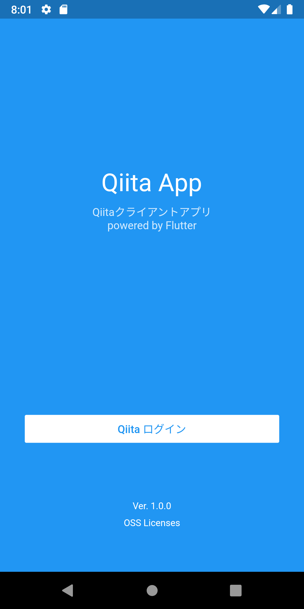
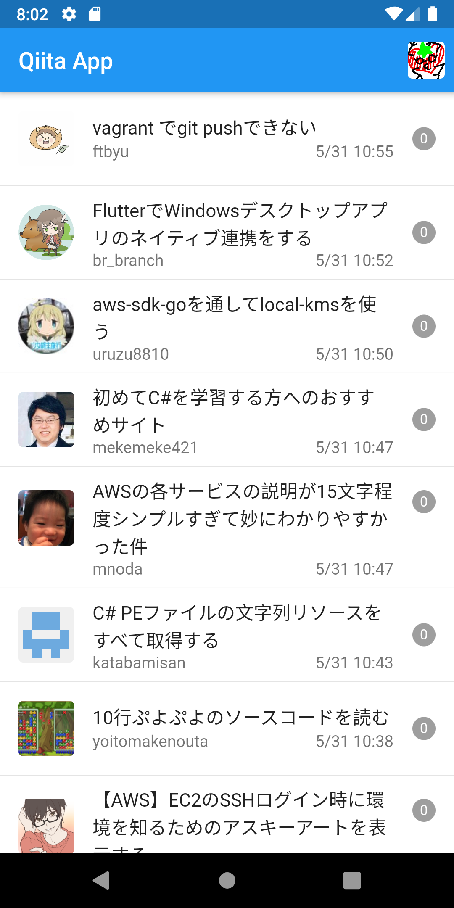
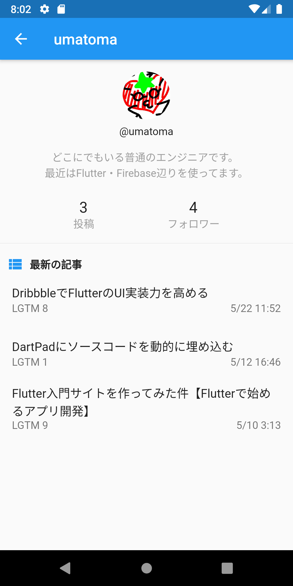
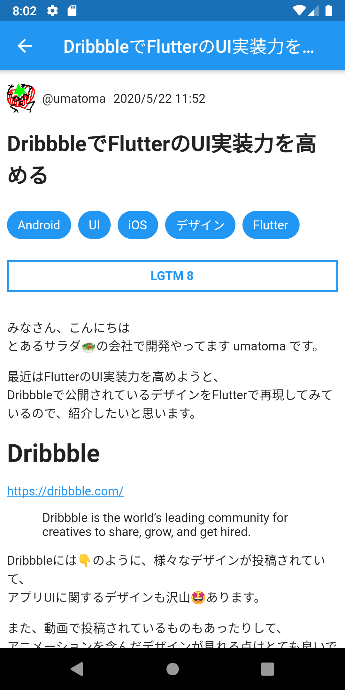

import ExternalLink from '@rocketseat/gatsby-theme-docs/src/components/Sidebar/ExternalLink';

## アプリを作ってみる

Flutterを使って様々なアプリを作り、  
iOS/Android/Webアプリとして公開できるようになりましょう 💪

## こんな機能を実装したい

- [Providerで状態管理](/create-app/provider)
- [音楽・動画を再生する](/create-app/media-player)

## アプリ作成例

実際にアプリを作りながら、  
API通信方法・アーキテクチャ設計など様々な知識を身に着けていきましょう。

そして、作ったアプリに機能追加をして、  
オリジナルアプリとして公開してみましょう🚀🚀🚀

### アプリ公開方法

- [Androidアプリを公開する](/create-app/publish-android)
- <ExternalLink link="https://flutter.dev/docs/deployment/ios" label="iOSアプリを公開する" />
- [Webアプリを公開する](/host-web-app/host-web-app)

自動化
- [Codemagicでテスト・ビルド・配信を自動化](/create-app/codemagic)

### Qiita App

[Qiita App - Qiitaクライアントアプリ](/create-app/qiita-app)

<table>
    <tbody>
        <tr>
            <td width="25%">
                
            </td>
            <td width="25%">
                
            </td>
            <td width="25%">
                
            </td>
            <td width="25%">
                
            </td>
        </tr>
    </tbody>
</table>

この他にも随時アプリを追加していく予定です🙇‍♂️
