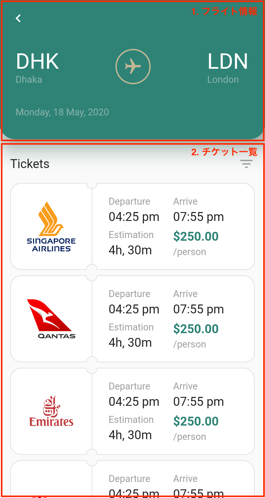
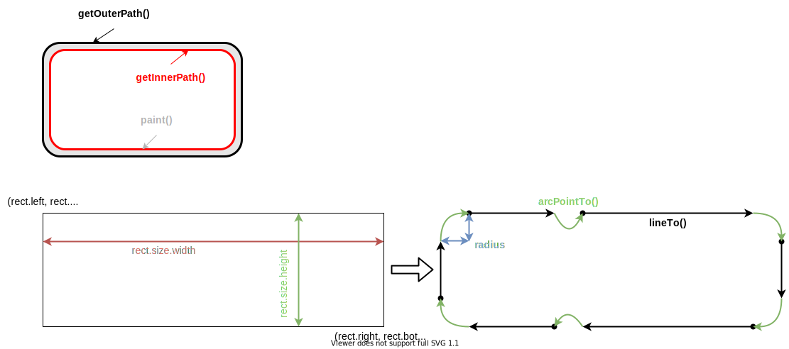

## 今回作成するUI

今回作成するUIは👇をベースに考えています。

- [Flight and Hotel Booking App by Subash Chandra](https://dribbble.com/shots/11424144-Flight-and-Hotel-Booking-App)


## 完成イメージ

以下のような画面を作ってみましょう。

今回は大きく分けて2つの要素に分かれています。

1. フライト情報
2. チケット一覧

それでは、各要素ごとにUIを作ってみましょう。

<table>
    <tbody>
        <tr>
            <td width="50%">
                
            </td>
            <td width="50%">
                
            </td>
        </tr>
    </tbody>
</table>




## 共通部分・AppBar

まずはじめに、各Widgetを表示する土台となる部分を作り、  
`AppBar` を配置しましょう。

```dart
import 'dart:math';
import 'dart:ui';

import 'package:flutter/material.dart';

const kColorPrimary = Color(0xFF2E8376);
const kColorText = Color(0xFF9E9E9E);
const kColorTextDark = Color(0xFF212121);
const kColorFlightText = Color(0xFFE0E0E0);
const kColorFlightIcon = Color(0xFFC1B695);
const kColorTicketBorder = Color(0xFFE0E0E0);
const kSingaporeLogoUrl = 'https://user-images.githubusercontent.com/7200238/82220821-1ebc8880-995a-11ea-9d77-07edda64f05c.png';
const kQantasLogoUrl = 'https://user-images.githubusercontent.com/7200238/82220824-1fedb580-995a-11ea-8124-f59daff4ebda.png';
const kEmiratesLogoUrl = 'https://user-images.githubusercontent.com/7200238/82220816-1c5a2e80-995a-11ea-921d-38b3f991d8d2.png';
const kHainanLogoUrl = 'https://user-images.githubusercontent.com/7200238/82223309-73adce00-995d-11ea-98c0-2dba4e094aca.png';

void main() {
  runApp(MyApp());
}

class MyApp extends StatelessWidget {
  @override
  Widget build(BuildContext context) {
    return MaterialApp(
      debugShowCheckedModeBanner: false,
      title: 'Flutter Demo',
      theme: ThemeData(
        primaryColor: Color(0xFF2E8376),
      ),
      home: FlightBookingPage(),
    );
  }
}

class FlightBookingPage extends StatelessWidget {
  @override
  Widget build(BuildContext context) {
    return Scaffold(
      appBar: AppBar(
        elevation: 0,
        leading: Icon(Icons.navigate_before),
      ),
      body: Column(
        children: [
          /* ここにWidgetを並べていく */
        ],
      ),
    );
  }
}
```

## フライト情報

次にフライト情報の部分を作っていきましょう。

フライト情報にはテキストとアイコンを並べていきます。

提供されている `flight` アイコンは、飛行機が上を向いているデザインになっています。  
ここでは、**右を向いたデザインにしたい**のですが、どの様にすれば良いでしょうか？

この様にWidgetを変形させたい時は `Transform` を使うと便利です。  
`Transform` では色々な機能が提供されてますが、  
ここでは `Transform.rotate()` を使い、Wigetを回転させてみましょう。



https://www.youtube.com/watch?v=9z_YNlRlWfA

```dart
class _AirportName extends StatelessWidget {
  final String shortName;
  final String fullName;

  const _AirportName({
    Key key,
    @required this.shortName,
    @required this.fullName,
  }) : super(key: key);

  @override
  Widget build(BuildContext context) {
    return Column(
      crossAxisAlignment: CrossAxisAlignment.start,
      children: [
        Text(
          shortName,
          style: TextStyle(
            color: Colors.white,
            fontSize: 32,
          ),
        ),
        Text(
          fullName,
          style: TextStyle(
            color: kColorFlightText.withOpacity(0.5),
          ),
        ),
      ],
    );
  }
}

class _FlightIcon extends StatelessWidget {
  @override
  Widget build(BuildContext context) {
    return Container(
      width: 52,
      height: 52,
      decoration: BoxDecoration(
        border: Border.all(
          color: kColorFlightIcon,
          width: 2,
        ),
        borderRadius: BorderRadius.circular(52 / 2),
      ),
      child: Transform.rotate(
        angle: pi / 2,
        child: Icon(
          Icons.flight,
          color: kColorFlightIcon,
          size: 28,
        ),
      ),
    );
  }
}

class FlightInfo extends StatelessWidget {
  @override
  Widget build(BuildContext context) {
    return Column(
      children: [
        Material(
          color: kColorPrimary,
          elevation: 24,
          shadowColor: kColorPrimary,
          borderRadius: BorderRadius.only(
            bottomRight: Radius.circular(24),
            bottomLeft: Radius.circular(24),
          ),
          child: Padding(
            padding: const EdgeInsets.only(
              left: 24,
              right: 24,
              top: 16,
              bottom: 32,
            ),
            child: Column(
              children: [
                Row(
                  mainAxisAlignment: MainAxisAlignment.spaceBetween,
                  children: [
                    _AirportName(shortName: 'DHK', fullName: 'Dhaka'),
                    _FlightIcon(),
                    _AirportName(shortName: 'LDN', fullName: 'London'),
                  ],
                ),
                SizedBox(height: 32),
                Container(
                  alignment: Alignment.centerLeft,
                  child: Text(
                    'Monday, 18 May, 2020',
                    style: TextStyle(color: kColorFlightText.withOpacity(0.5)),
                  ),
                ),
              ],
            ),
          ),
        ),
      ],
    );
  }
}
```


## チケット一覧

次にチケット一覧の部分を作っていきましょう。

ここで、難しそうなのは  
各チケットの**複雑な形をしたボーダーを実装する方法**でしょうか。

実装方針として以下の2つが考えられます。

1. `CustomPaint` を使い、ボーダーを含めた背景を描画する
2. `ShapeBorder` を使い、ボーダーを描画する

ここでは、`ShapeBorder`を使う方法で実装してみます。

`ShapeBorder`を使うと、  
Widgetのボーダーを描画しボーダーの形でWidgetの枠を形作る事ができます。

基本的には `Path` で、ボーダーの形を作ってあげればOKです。  
今回のチケットの形だと `line` と `ark` を組み合わせることで作れそうですね。  
（※ 2020年5月時点：Webでは不具合のため上手く描画されません）



また、チケット右側の詳細情報部分は `Table` を使うと簡単に実装できます。  
格子状にWidgetを使う時は `Table` を使っていきましょう。

https://www.youtube.com/watch?v=_lbE0wsVZSw

```dart
class _TicketShapeBorder extends ShapeBorder {
  final double width;
  final double radius;

  _TicketShapeBorder({
    @required this.width,
    @required this.radius,
  });

  @override
  EdgeInsetsGeometry get dimensions {
    return EdgeInsets.all(width);
  }

  @override
  ShapeBorder scale(double t) {
    return _TicketShapeBorder(
      width: width * t,
      radius: radius * t,
    );
  }

  @override
  ShapeBorder lerpFrom(ShapeBorder a, double t) {
    if (a is _TicketShapeBorder)
      return _TicketShapeBorder(
        width: lerpDouble(a.width, width, t),
        radius: lerpDouble(a.radius, radius, t),
      );
    return super.lerpFrom(a, t);
  }

  @override
  ShapeBorder lerpTo(ShapeBorder b, double t) {
    if (b is _TicketShapeBorder)
      return _TicketShapeBorder(
        width: lerpDouble(width, b.width, t),
        radius: lerpDouble(radius, b.radius, t),
      );
    return super.lerpTo(b, t);
  }

  @override
  Path getInnerPath(Rect rect, {TextDirection textDirection}) {
    return getOuterPath(
      rect.deflate(width),
      textDirection: textDirection,
    );
  }

  @override
  Path getOuterPath(Rect rect, {TextDirection textDirection}) {
    final r = radius;
    final rs = radius / 2; // 区切り部分の半径
    final w = rect.size.width; // 全体の横幅
    final h = rect.size.height; // 全体の縦幅
    final wl = w / 3; // ロゴ部分の横幅
    return Path()
      ..addPath(
        Path()
          ..moveTo(r, 0)
          ..lineTo(wl - rs, 0) // →
          ..arcToPoint(
            Offset(wl + rs, 0),
            radius: Radius.circular(rs),
            clockwise: false,
          )
          ..lineTo(w - r, 0) // →
          ..arcToPoint(Offset(w, r), radius: Radius.circular(r))
          ..lineTo(w, h - rs) // ↓
          ..arcToPoint(Offset(w - r, h), radius: Radius.circular(r))
          ..lineTo(wl + rs, h) // ←
          ..arcToPoint(
            Offset(wl - rs, h),
            radius: Radius.circular(rs),
            clockwise: false,
          )
          ..lineTo(r, h) // ←
          ..arcToPoint(Offset(0, h - r), radius: Radius.circular(r))
          ..lineTo(0, r) // ↑
          ..arcToPoint(Offset(r, 0), radius: Radius.circular(r)),
        Offset(rect.left, rect.top),
      );
  }

  @override
  void paint(Canvas canvas, Rect rect, {TextDirection textDirection}) {
    final paint = Paint()
      ..style = PaintingStyle.stroke
      ..strokeWidth = width
      ..color = kColorTicketBorder;
    canvas.drawPath(
      getOuterPath(
        rect.deflate(width / 2.0),
        textDirection: textDirection,
      ),
      paint,
    );
  }
}

class _Ticket extends StatelessWidget {
  final Widget image;

  const _Ticket({
    Key key,
    @required this.image,
  }) : super(key: key);

  @override
  Widget build(BuildContext context) {
    return Container(
      width: double.infinity,
      height: 128,
      decoration: ShapeDecoration(
        color: Colors.white,
        shape: _TicketShapeBorder(width: 1, radius: 16.0),
      ),
      child: Row(
        children: [
          Expanded(
            flex: 1,
            child: Container(
              padding: EdgeInsets.all(24),
              child: image,
            ),
          ),
          Container(
            width: 1,
            height: double.infinity,
            margin: EdgeInsets.symmetric(vertical: 8.0),
            color: kColorTicketBorder,
          ),
          Expanded(
            flex: 2,
            child: Container(
              padding: EdgeInsets.symmetric(horizontal: 24),
              child: Table(
                children: [
                  TableRow(
                    children: [
                      Column(
                        crossAxisAlignment: CrossAxisAlignment.start,
                        children: [
                          Text(
                            'Departure',
                            style: TextStyle(color: kColorText),
                          ),
                          SizedBox(height: 4),
                          Text(
                            '04:25 pm',
                            style: TextStyle(
                              color: kColorTextDark,
                              fontSize: 18,
                            ),
                          ),
                        ],
                      ),
                      Column(
                        crossAxisAlignment: CrossAxisAlignment.start,
                        children: [
                          Text(
                            'Arrive',
                            style: TextStyle(color: kColorText),
                          ),
                          SizedBox(height: 4),
                          Text(
                            '07:55 pm',
                            style: TextStyle(
                              color: kColorTextDark,
                              fontSize: 18,
                            ),
                          ),
                        ],
                      ),
                    ],
                  ),
                  TableRow(
                    children: [
                      SizedBox(height: 8),
                      SizedBox(height: 8),
                    ],
                  ),
                  TableRow(
                    children: [
                      Column(
                        crossAxisAlignment: CrossAxisAlignment.start,
                        children: [
                          Text(
                            'Estimation',
                            style: TextStyle(color: kColorText),
                          ),
                          SizedBox(height: 4),
                          Text(
                            '4h, 30m',
                            style: TextStyle(
                              color: kColorTextDark,
                              fontSize: 18,
                            ),
                          ),
                        ],
                      ),
                      Column(
                        crossAxisAlignment: CrossAxisAlignment.start,
                        children: [
                          Text(
                            '\$250.00',
                            style: TextStyle(
                              color: kColorPrimary,
                              fontSize: 18,
                              fontWeight: FontWeight.bold,
                            ),
                          ),
                          SizedBox(height: 4),
                          Text(
                            '/person',
                            style: TextStyle(color: kColorText),
                          ),
                        ],
                      ),
                    ],
                  ),
                ],
              ),
            ),
          ),
        ],
      ),
    );
  }
}

class TicketList extends StatelessWidget {
  @override
  Widget build(BuildContext context) {
    return Expanded(
      child: Column(
        children: [
          Padding(
            padding: const EdgeInsets.only(
              top: 24,
              bottom: 8,
              left: 16,
              right: 16,
            ),
            child: Row(
              mainAxisAlignment: MainAxisAlignment.spaceBetween,
              children: [
                Text(
                  'Tickets',
                  style: TextStyle(
                    color: kColorTextDark,
                    fontSize: 18,
                  ),
                ),
                Icon(Icons.filter_list, color: kColorText),
              ],
            ),
          ),
          Expanded(
            child: SingleChildScrollView(
              child: Padding(
                padding: const EdgeInsets.symmetric(
                  horizontal: 16,
                  vertical: 8,
                ),
                child: Column(
                  children: [
                    _Ticket(
                      image: Image.network(kSingaporeLogoUrl),
                    ),
                    SizedBox(height: 8),
                    _Ticket(
                      image: Image.network(kQantasLogoUrl),
                    ),
                    SizedBox(height: 8),
                    _Ticket(
                      image: Image.network(kEmiratesLogoUrl),
                    ),
                    SizedBox(height: 8),
                    _Ticket(
                      image: Image.network(kHainanLogoUrl),
                    ),
                  ],
                ),
              ),
            ),
          )
        ],
      ),
    );
  }
}
```


## 作成したWidgetを表示

最後に、作成したフライト情報・チケット一覧のWidgetを表示しましょう。  
最初に作成した、土台部分に組み込めばOKです。

```dart
class FlightBookingPage extends StatelessWidget {
  @override
  Widget build(BuildContext context) {
    return Scaffold(
      appBar: AppBar(
        elevation: 0,
        leading: Icon(Icons.navigate_before),
      ),
      body: Column(
        children: [
          FlightInfo(),
          TicketList(),
        ],
      ),
    );
  }
}
```


## お疲れさまでした

UIは無事作成できたでしょうか？  
この他にも様々なUIを作ってみて、Flutterで複雑なUIが表現できるように頑張りましょう 💪

- [UIを作ってみる](/create-ui/top)


### ソースコード

- [flight_booking](https://github.com/umatoma/flutter-study-samples/tree/master/flight_booking)
