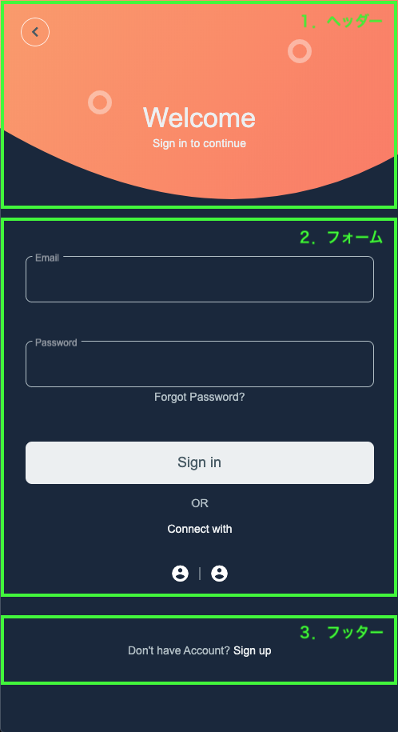

## 今回作成するUI

今回作成するUIは👇をベースに考えています。

- [Sign In/ Sign Up Page App UI by Md. Hafizur Rahaman](https://dribbble.com/shots/11433513-Sign-In-Sign-Up-Page-App-UI)


## 完成イメージ

以下のようなログインページを作ってみましょう。

今回は大きく分けて3つの要素に分かれています。

1. ヘッダー
2. フォーム
3. フッター

それでは、各要素ごとにUIを作ってみましょう。

<table>
    <tbody>
        <tr>
            <td width="50%">
                
            </td>
            <td width="50%">
                
            </td>
        </tr>
    </tbody>
</table>


## 共通部分

まずはじめに、ヘッダー・フォーム・フッターを表示する土台となる部分を  
作ってしまいたいと思います。

```dart
import 'package:flutter/material.dart';

const Color kAccentColor = Color(0xFFFE7C64);
const Color kBackgroundColor = Color(0xFF19283D);
const Color kTextColorPrimary = Color(0xFFECEFF1);
const Color kTextColorSecondary = Color(0xFFB0BEC5);
const Color kButtonColorPrimary = Color(0xFFECEFF1);
const Color kButtonTextColorPrimary = Color(0xFF455A64);
const Color kIconColor = Color(0xFF455A64);

void main() {
  runApp(MyApp());
}

class MyApp extends StatelessWidget {
  @override
  Widget build(BuildContext context) {
    return MaterialApp(
      debugShowCheckedModeBanner: false,
      title: 'Flutter Demo',
      theme: ThemeData.dark().copyWith(
        accentColor: kAccentColor,
      ),
      home: WelcomePage(),
    );
  }
}

class WelcomePage extends StatelessWidget {
  @override
  Widget build(BuildContext context) {
    return Scaffold(
      backgroundColor: kBackgroundColor,
      body: SafeArea(
        child: SingleChildScrollView(
          child: Column(
            children: [
                /* ここに、ヘッダー・フォーム・フッターを並べていく */
            ],
          ),
        ),
      ),
    );
  }
}
```

## ヘッダー

次にヘッダー部分を作っていきましょう。

UIを作成するための、大まかな方針としては以下の4つの要素に分割し、  
それぞれを重ねていくイメージで行きたいと思います。

1. 背景
2. 丸を描く
3. タイトル
4. 戻るボタン




### 背景

背景は下の部分が丸みを帯びた形をしています。  
この様な変形した枠のあるUIを作りたい時は `ClipPath` が使えますね。

オレンジ色の背景色を持った `Container` を `ClipPath` で下部分が丸みを帯びるようくり抜くのです。



https://www.youtube.com/watch?v=oAUebVIb-7s

```dart
class _HeaderCurveClipper extends CustomClipper<Path> {
  @override
  Path getClip(Size size) {
    return Path()
      ..lineTo(0, size.height * 0.5)
      ..quadraticBezierTo(
        size.width * 0.55,
        size.height,
        size.width,
        size.height * 0.6,
      )
      ..lineTo(size.width, 0)
      ..close();
  }

  @override
  bool shouldReclip(CustomClipper<Path> oldClipper) {
    return true;
  }
}

class _HeaderBackground extends StatelessWidget {
  final double height;

  const _HeaderBackground({
    Key? key,
    required this.height,
  }) : super(key: key);

  @override
  Widget build(BuildContext context) {
    return ClipPath(
      clipper: _HeaderCurveClipper(),
      child: Container(
        width: double.infinity,
        height: height,
        decoration: BoxDecoration(
          gradient: LinearGradient(
            begin: FractionalOffset.topLeft,
            end: FractionalOffset.bottomRight,
            colors: [
              Color(0xFFFD9766),
              Color(0xFFFF7362),
            ],
            stops: [0, 1],
          ),
        ),
      ),
    );
  }
}
```


### 丸を描く

丸を描く部分は、`CustomPaint` を使い2つの円を描きましょう。  
細かい部分の描画であったり、複雑な描画が必要なものは `CustomPaint` を使うと便利ですね。

https://www.youtube.com/watch?v=kp14Y4uHpHs

```dart
class _HeaderCirclePainter extends CustomPainter {
  @override
  void paint(Canvas canvas, Size size) {
    final paint = Paint()
      ..color = Colors.white.withOpacity(0.4)
      ..style = PaintingStyle.stroke
      ..strokeWidth = 6;

    canvas.drawCircle(
      Offset(size.width * 0.25, size.height * 0.4),
      12,
      paint,
    );
    canvas.drawCircle(
      Offset(size.width * 0.75, size.height * 0.2),
      12,
      paint,
    );
  }

  @override
  bool shouldRepaint(CustomPainter oldDelegate) {
    return false;
  }
}

class _HeaderCircles extends StatelessWidget {
  final double height;

  const _HeaderCircles({
    Key? key,
    required this.height,
  }) : super(key: key);

  @override
  Widget build(BuildContext context) {
    return CustomPaint(
      painter: _HeaderCirclePainter(),
      child: Container(
        width: double.infinity,
        height: height,
      ),
    );
  }
}
```


### タイトル・戻るボタン

残りはタイトルと戻るボタンを作成し、`Stack` で各Widgetを重ねて表示しましょう。  
この様に複数のWidgetを重ねて表現するようなUIでは `Stack` を使うと良いですね。

https://www.youtube.com/watch?v=liEGSeD3Zt8

```dart
class _HeaderTitle extends StatelessWidget {
  @override
  Widget build(BuildContext context) {
    return Column(
      mainAxisSize: MainAxisSize.min,
      children: [
        Text(
          'Welcome',
          style: Theme.of(context).textTheme.headline4!.copyWith(
                color: kTextColorPrimary,
                fontWeight: FontWeight.w500,
              ),
        ),
        SizedBox(height: 4),
        Text(
          'Sign in to continue',
          style: Theme.of(context)
              .textTheme
              .subtitle2!
              .copyWith(color: kTextColorPrimary),
        ),
      ],
    );
  }
}

class _HeaderBackButton extends StatelessWidget {
  @override
  Widget build(BuildContext context) {
    return TextButton(
      style: TextButton.styleFrom(
        primary: kButtonTextColorPrimary,
        backgroundColor: Colors.transparent,
        shape: CircleBorder(
          side: BorderSide(color: kButtonColorPrimary),
        ),
      ),
      onPressed: () {},
      child: Icon(Icons.chevron_left, color: kIconColor),
    );
  }
}

class _Header extends StatelessWidget {
  @override
  Widget build(BuildContext context) {
    final double height = 320;
    return Container(
      height: height,
      child: Stack(
        children: [
          Align(
            alignment: Alignment.topCenter,
            child: _HeaderBackground(height: height),
          ),
          Align(
            alignment: Alignment.topCenter,
            child: _HeaderCircles(height: height),
          ),
          Align(
            alignment: Alignment.topCenter,
            child: Padding(
              padding: EdgeInsets.only(top: 128),
              child: _HeaderTitle(),
            ),
          ),
          Positioned(
            top: 16,
            left: 0,
            child: _HeaderBackButton(),
          ),
        ],
      ),
    );
  }
}
```


## フォーム

次は、フォーム部分を作っていきましょう。  
ここは、特に難しいことはなく、`Column` を使い各要素を上から下に並べていけばOKですね。


```dart
class _CustomTextField extends StatelessWidget {
  final String labelText;
  final String hintText;
  final bool obscureText;

  const _CustomTextField({
    Key? key,
    required this.labelText,
    required this.hintText,
    required this.obscureText,
  }) : super(key: key);

  @override
  Widget build(BuildContext context) {
    return TextField(
      decoration: InputDecoration(
        labelText: labelText,
        hintText: hintText,
        hintStyle: TextStyle(color: kTextColorSecondary),
        floatingLabelBehavior: FloatingLabelBehavior.always,
        focusedBorder: OutlineInputBorder(
          borderRadius: BorderRadius.circular(8),
          borderSide: BorderSide(
            color: kAccentColor,
          ),
        ),
        enabledBorder: OutlineInputBorder(
          borderRadius: BorderRadius.circular(8),
          borderSide: BorderSide(
            color: kTextColorSecondary,
          ),
        ),
      ),
      obscureText: obscureText,
      onTap: () {},
    );
  }
}

class _SignInForm extends StatelessWidget {
  @override
  Widget build(BuildContext context) {
    return Column(
      children: [
        _CustomTextField(
          labelText: 'Email',
          hintText: 'your email address goes here',
          obscureText: false,
        ),
        SizedBox(height: 48),
        _CustomTextField(
          labelText: 'Password',
          hintText: 'your password goes here',
          obscureText: true,
        ),
        SizedBox(height: 4),
        Text(
          'Forgot Password?',
          style: Theme.of(context)
              .textTheme
              .bodyText2!
              .copyWith(color: kTextColorSecondary),
        ),
        SizedBox(height: 48),
        Container(
          width: double.infinity,
          child: TextButton(
            style: TextButton.styleFrom(
              primary: kButtonTextColorPrimary,
              backgroundColor: kButtonColorPrimary,
              padding: EdgeInsets.symmetric(vertical: 16),
              shape: RoundedRectangleBorder(
                borderRadius: BorderRadius.circular(8),
              ),
            ),
            onPressed: () {},
            child: Text(
              'Sign in',
              style: Theme.of(context)
                  .textTheme
                  .button!
                  .copyWith(color: kButtonTextColorPrimary, fontSize: 18),
            ),
          ),
        ),
        SizedBox(height: 16),
        Text(
          'OR',
          style: Theme.of(context)
              .textTheme
              .bodyText2!
              .copyWith(color: kTextColorSecondary),
        ),
        SizedBox(height: 16),
        Text(
          'Connect with',
          style: Theme.of(context)
              .textTheme
              .bodyText2
              .copyWith(color: kTextColorPrimary),
        ),
        SizedBox(height: 24),
        Row(
          mainAxisAlignment: MainAxisAlignment.center,
          children: [
            IconButton(
              icon: Icon(Icons.account_circle),
              onPressed: () {},
            ),
            Container(
              color: kTextColorSecondary,
              width: 1,
              height: 16,
            ),
            IconButton(
              icon: Icon(Icons.account_circle),
              onPressed: () {},
            ),
          ],
        )
      ],
    );
  }
}
```


## フッター

次は、フッター部分を作っていきましょう。  
テキストを表示すればOKですね、さくっと作ってしまいましょう。

```dart
class _Footer extends StatelessWidget {
  @override
  Widget build(BuildContext context) {
    return Row(
      mainAxisAlignment: MainAxisAlignment.center,
      children: [
        Text(
          'Don\'t have Account?',
          style: Theme.of(context)
              .textTheme
              .bodyText2!
              .copyWith(color: kTextColorSecondary),
        ),
        SizedBox(width: 4),
        Text(
          'Sign up',
          style: Theme.of(context)
              .textTheme
              .bodyText2!
              .copyWith(color: kTextColorPrimary),
        ),
      ],
    );
  }
}
```


## 作成したWidgetを表示

最後に、作成したヘッダー・フォーム・フッターのWidgetを表示しましょう。  
最初に作成した、土台部分に組み込めばOKです。

```dart
class WelcomePage extends StatelessWidget {
  @override
  Widget build(BuildContext context) {
    return Scaffold(
      backgroundColor: kBackgroundColor,
      body: SafeArea(
        child: SingleChildScrollView(
          child: Column(
            children: [
              _Header(),
              Padding(
                padding: const EdgeInsets.symmetric(horizontal: 32),
                child: _SignInForm(),
              ),
              Padding(
                padding: const EdgeInsets.symmetric(vertical: 64),
                child: _Footer(),
              ),
            ],
          ),
        ),
      ),
    );
  }
}
```


## お疲れさまでした

UIは無事作成できたでしょうか？  
この他にも様々なUIを作ってみて、Flutterで複雑なUIが表現できるように頑張りましょう 💪

- [UIを作ってみる](/create-ui/top)


### ソースコード

- [sign_in_out_page_app_ui](https://github.com/umatoma/flutter-study-samples/tree/master/sign_in_out_page_app_ui)