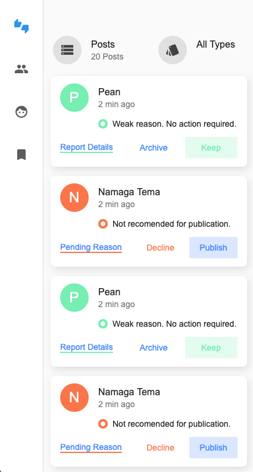
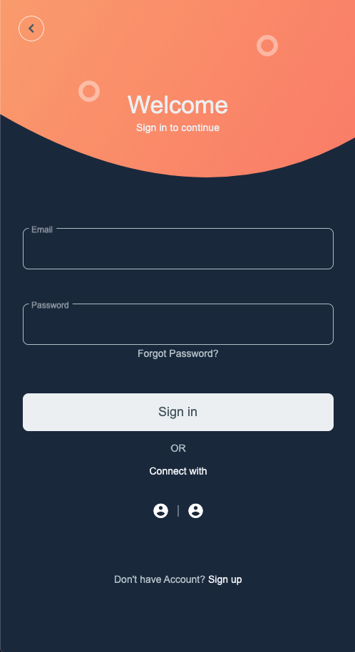
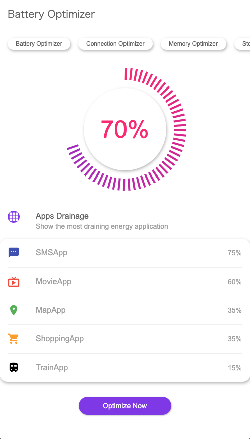
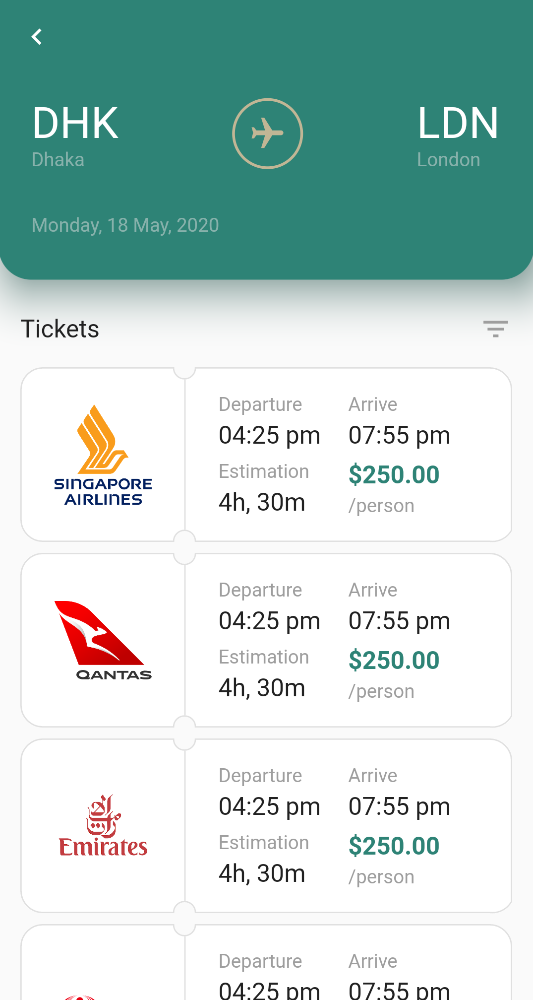

## 様々なUIを作ってみる

Flutterを使って様々なUIを作れるようになりましょう。  
ここでは、[dribble.com](https://dribbble.com/)で公開されているデザインをFlutterで再現していきます。

それでは早速始めてみましょう 💪

### 進め方

大きく2つのパートに分けてUIの作り方を身に着けていきます。

1. 初級編
    - アニメーションの無い静的なUIを作ってみる
2. 中級編
    - アニメーションの基礎を身につける
    - アニメーションを含んだ動的なUIを作ってみる

## 初級編

### アニメーションの無い静的なUIを作ってみる

<table className="ui-list-table">
    <tbody>
        <tr>
            <td width="50%">
                <a href="/create-ui/admin-mobile">
                    
Admin Mobile

                    
                </a>
            </td>
            <td width="50%">
                <a href="/create-ui/sign-in-sign-up">
                    
Sign In / Sign Up

                    
                </a>
            </td>
        </tr>
        <tr>
            <td width="50%">
                <a href="/create-ui/battery-optimizer">
                    
Battery Optimizer

                    
                </a>
            </td>
            <td width="50%">
                <a href="/create-ui/flight-booking">
                    
Flight Booking

                    
                </a>
            </td>
        </tr>
    </tbody>
</table>

## 中級編

### アニメーションの基礎を身につける

- [アニメーション基礎](/create-ui/animation)

### アニメーションを含んだ動的なUIを作ってみる

公開までお待ち下さい🙇‍♂️
