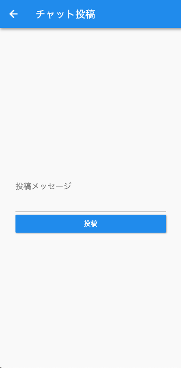
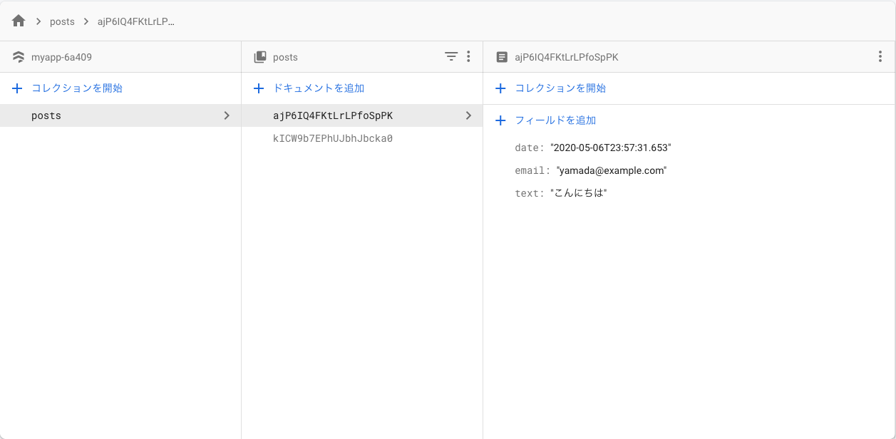
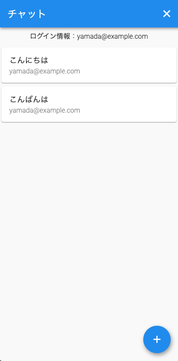

## このページのゴール

- チャットアプリで投稿一覧表を表示できるようにする
- チャットアプリで投稿できるようにする
- チャットアプリで投稿を削除できるようにする


## チャットアプリ全体像

### 機能一覧

- ✨ メールアドレス・パスワードでログインできる
- ✨ ログアウトできる
- ✨ **チャットの投稿一覧を表示できる** 👈
- ✨ **チャットに投稿できる** 👈
- ✨ **チャットの投稿を削除できる** 👈

### イメージ図



### ❗️ 注意事項 ❗️

プロジェクト・雛形の作成が終わっていない場合は  
[Firebaseを使ったアプリ概要](/firebase-app/about-firebase-app)のページを確認しましょう。


## Firestore初期設定

[Firestore概要ページ](/firebase/cloud-firestore)を参考に、  
`Firestoreの有効化` と `Webアプリ用セットアップ` を行いましょう。


## 投稿する

それでは早速、投稿機能の実装から始めてみましょう 🤩

Firestoreに投稿したデータを保存するようにします。  
ここでは、`posts`コレクション内のドキュメントにデータを保存することとしましょう。

[Authenticationでログイン](/firebase-app/authentication)のソースコードの続きから始めます。  
`lib/main.dart` の `AddPostPage` Widget と `ChatPage` Widget を以下のように書き換えましょう。

### 解説

- `AddPostPage` Widgetの引数からユーザー情報を受け取る
- `text` `email` `date` を指定して `posts`コレクション内にドキュメント作成
- Authentication管理画面から作成されたドキュメントが確認できる
- Firestoreに関しておさらいしたい場合は以下のページを確認しましょう
    - [Firestore概要](/firebase/cloud-firestore)
    - [Firestoreを使ってみる](/firebase/cloud-firestore-try)

### スクリーンショット

<table>
    <thead>
        <tr>
            <th>投稿画面</th>
            <th>Authentication管理画面</th>
        </tr>
    </thead>
    <tbody>
        <tr>
            <td width="25%"></td>
            <td width="75%"></td>
        </tr>
    </tbody>
</table>

### ソースコード

```dart
import 'package:cloud_firestore/cloud_firestore.dart';
import 'package:firebase_auth/firebase_auth.dart';
import 'package:flutter/material.dart';

/* --- 省略 --- */

// チャット画面用Widget
class ChatPage extends StatelessWidget {

  /* --- 省略 --- */

  @override
  Widget build(BuildContext context) {
    return Scaffold(
      /* --- 省略 --- */
      floatingActionButton: FloatingActionButton(
        child: Icon(Icons.add),
        onPressed: () async {
          // 投稿画面に遷移
          await Navigator.of(context).push(
            MaterialPageRoute(builder: (context) {
              // 引数からユーザー情報を渡す
              return AddPostPage(user);
            }),
          );
        },
      ),
    );
  }
}

// 投稿画面用Widget
class AddPostPage extends StatefulWidget {
  // 引数からユーザー情報を受け取る
  AddPostPage(this.user);
  // ユーザー情報
  final User user;

  @override
  _AddPostPageState createState() => _AddPostPageState();
}

class _AddPostPageState extends State<AddPostPage> {
  // 入力した投稿メッセージ
  String messageText = '';

  @override
  Widget build(BuildContext context) {
    return Scaffold(
      appBar: AppBar(
        title: Text('チャット投稿'),
      ),
      body: Center(
        child: Container(
          padding: EdgeInsets.all(32),
          child: Column(
            mainAxisAlignment: MainAxisAlignment.center,
            children: <Widget>[
              // 投稿メッセージ入力
              TextFormField(
                decoration: InputDecoration(labelText: '投稿メッセージ'),
                // 複数行のテキスト入力
                keyboardType: TextInputType.multiline,
                // 最大3行
                maxLines: 3,
                onChanged: (String value) {
                  setState(() {
                    messageText = value;
                  });
                },
              ),
              const SizedBox(height: 8),
              Container(
                width: double.infinity,
                child: ElevatedButton(
                  child: Text('投稿'),
                  onPressed: () async {
                    final date =
                        DateTime.now().toLocal().toIso8601String(); // 現在の日時
                    final email = widget.user.email; // AddPostPage のデータを参照
                    // 投稿メッセージ用ドキュメント作成
                    await FirebaseFirestore.instance
                        .collection('posts') // コレクションID指定
                        .doc() // ドキュメントID自動生成
                        .set({
                      'text': messageText,
                      'email': email,
                      'date': date
                    });
                    // 1つ前の画面に戻る
                    Navigator.of(context).pop();
                  },
                ),
              )
            ],
          ),
        ),
      ),
    );
  }
}
```


## 投稿一覧を表示する

次は、投稿したメッセージの一覧をチャット画面に表示します。

`posts`コレクション内のドキュメント一覧をFirestoreから取得して、  
`ListView` Widgetを使い一覧表示すればよさそうですね。

`lib/main.dart` の `ChatPage` Widgetを以下のように書き換えましょう。

### 解説

- `FutureBuilder`を使い非同期処理の結果を元にWidgetを作成
  - ここでは、これを使えば良いのか程度に覚えてもらえばOKです
- `posts`コレクション内のドキュメント一覧を取得
- 取得した投稿メッセージ一覧のデータを元にリスト表示
- **メッセージを投稿した後に、画面に表示されないのは微妙ですね** 😥😥😥
  - ログアウトして再ログインすると表示されますね
  - **後で改善しましょう** 💪

### スクリーンショット

<table>
    <thead>
        <tr>
            <th>チャット画面</th>
            <th></th>
        </tr>
    </thead>
    <tbody>
        <tr>
            <td width="50%"></td>
            <td width="50%"></td>
        </tr>
    </tbody>
</table>

### ソースコード

```dart
// チャット画面用Widget
class ChatPage extends StatelessWidget {
  
  /* --- 省略 --- */

  @override
  Widget build(BuildContext context) {
    return Scaffold(
      /* --- 省略 --- */
      body: Column(
        children: [
          Container(
            padding: EdgeInsets.all(8),
            child: Text('ログイン情報：${user.email}'),
          ),
          Expanded(
            // FutureBuilder
            // 非同期処理の結果を元にWidgetを作れる
            child: FutureBuilder<QuerySnapshot>(
              // 投稿メッセージ一覧を取得（非同期処理）
              // 投稿日時でソート
              future: FirebaseFirestore.instance
                  .collection('posts')
                  .orderBy('date')
                  .get(),
              builder: (context, snapshot) {
                // データが取得できた場合
                if (snapshot.hasData) {
                  final List<DocumentSnapshot> documents = snapshot.data!.docs;
                  // 取得した投稿メッセージ一覧を元にリスト表示
                  return ListView(
                    children: documents.map((document) {
                      return Card(
                        child: ListTile(
                          title: Text(document['text']),
                          subtitle: Text(document['email']),
                        ),
                      );
                    }).toList(),
                  );
                }
                // データが読込中の場合
                return Center(
                  child: Text('読込中...'),
                );
              },
            ),
          ),
        ],
      ),
      floatingActionButton: FloatingActionButton(
        child: Icon(Icons.add),
        onPressed: () async {
          /* --- 省略 --- */
        },
      ),
    );
  }
}
```


## 投稿を削除する

次は、投稿したメッセージを削除できるようにします。  
ログイン情報を元に自分の投稿したメッセージのみを削除するようにしましょう。

削除したい投稿メッセージのドキュメントを指定して、  
Firestoreの削除処理を行えば良さそうですね。

`lib/main.dart` の `ChatPage` Widgetを以下のように書き換えましょう。

### 解説

- メールアドレスを元に自分の投稿したメッセージを判定
- 自分の投稿したメッセージには削除ボタンを表示
- 選択した投稿メッセージのドキュメントを削除
- **削除ボタンを押した後に、画面から消えないのは微妙ですね** 😥😥😥
  - ログアウトして再ログインすると消えてますね
  - **後で改善しましょう** 💪


### スクリーンショット

<table>
    <thead>
        <tr>
            <th>チャット画面</th>
            <th></th>
        </tr>
    </thead>
    <tbody>
        <tr>
            <td width="50%"></td>
            <td width="50%"></td>
        </tr>
    </tbody>
</table>

### ソースコード

```dart
// チャット画面用Widget
class ChatPage extends StatelessWidget {
  
  /* --- 省略 --- */
  
  @override
  Widget build(BuildContext context) {
    return Scaffold(
      /* --- 省略 --- */
      body: Column(
        children: [
          /* --- 省略 --- */
          Expanded(
            // FutureBuilder
            // 非同期処理の結果を元にWidgetを作れる
            child: FutureBuilder<QuerySnapshot>(
              // 投稿メッセージ一覧を取得（非同期処理）
              // 投稿日時でソート
              future: FirebaseFirestore.instance
                  .collection('posts')
                  .orderBy('date')
                  .get(),
              builder: (context, snapshot) {
                // データが取得できた場合
                if (snapshot.hasData) {
                  final List<DocumentSnapshot> documents = snapshot.data!.docs;
                  // 取得した投稿メッセージ一覧を元にリスト表示
                  return ListView(
                    children: documents.map((document) {
                      return Card(
                        child: ListTile(
                          title: Text(document['text']),
                          subtitle: Text(document['email']),
                          // 自分の投稿メッセージの場合は削除ボタンを表示
                          trailing: document['email'] == user.email
                              ? IconButton(
                                  icon: Icon(Icons.delete),
                                  onPressed: () async {
                                    // 投稿メッセージのドキュメントを削除
                                    await FirebaseFirestore.instance
                                        .collection('posts')
                                        .doc(document.id)
                                        .delete();
                                  },
                                )
                              : null,
                        ),
                      );
                    }).toList(),
                  );
                }
                /* --- 省略 --- */
              },
            ),
          ),
        ],
      ),
      floatingActionButton: FloatingActionButton(
        child: Icon(Icons.add),
        onPressed: () async {
          /* --- 省略 --- */
        },
      ),
    );
  }
}
```


## チャット機能 完成？

お疲れさまでした。
チャット機能の実装が完成しました？

投稿した後や削除した後に画面に反映されないのは微妙ですよね 😥😥😥  
どうすれば改善できるでしょうか？

実は、Firestoreには**リアルタイムにドキュメントの変更を検知**できる、  
素晴らしい機能があるのです 🤩

次回は、その機能を使ってチャット機能を改善してきましょう 💪💪💪


## ソースコード

全体のソースコードを確認したい時は [こちら](https://gist.github.com/umatoma/0bf9a23f28a686f4c70ec072b74d06ea) からどうぞ。 


## まとめ

- メッセージ投稿・一覧表示・削除機能を実装した
- メッセージ投稿・削除しても画面に反映されない 😥😥😥
- Firestoreの更新検知機能を使い改善していく

次は、Firestoreのドキュメント変更検知できる機能を使って、  
チャット機能を改善していきましょう 💪💪💪
