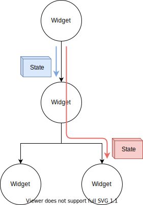

## このページのゴール

- Providerの概要と使い方を知る
- Providerを使いユーザー情報を管理する


## チャットアプリ全体像

### 機能一覧

- ✨ メールアドレス・パスワードでログインできる
- ✨ ログアウトできる
- ✨ チャットの投稿一覧を表示できる
- ✨ チャットに投稿できる
- ✨ チャットの投稿を削除できる

### イメージ図


### ❗️ 注意事項 ❗️

プロジェクト・雛形の作成が終わっていない場合は  
[Firebaseを使ったアプリ概要](/firebase-app/about-firebase-app)のページを確認しましょう。


## 状態管理

### 状態管理とは

まずは状態管理とは何であるかについて理解していきましょう。

[Widgetとは](/widgets/about-widget)では、  
Flutterは**Widgetをツリー状に組み合わせUIを実現**することを紹介しましたね。

そして、[状態を持ったWidget](/widgets/state-widget)では、  
**データを元にUIを作る**仕組みのことを**状態を持つ**と呼ぶことを紹介しましたね。


<table>
    <thead>
        <tr>
            <th>Widgetをツリー状に組み合わせUIを実現</th>
            <th>データを元にUIを作る</th>
        </tr>
    </thead>
    <tbody>
        <tr>
            <td width="40%"></td>
            <td width="60%"></td>
        </tr>
    </tbody>
</table>


これらの知識を組み合わせると、  
**様々なデータを元にアプリのUIを作っている**のです。

**様々なデータ**のことを**アプリの状態**と呼び、  
その**状態を扱いやすく管理する仕組み**のことを**状態管理**と言うのです。

状態管理を行っていないとデータの扱いが複雑になり、  
プログラムを書くのが大変になってしまうでしょう 😨😨😨




### Provider

[状態を持ったWidget](/widgets/state-widget)でも紹介したように、  
`StatefulWidget` と `State` を使えば状態を元にUIを作ることは可能です。

ですが、様々なWidgetが組み合わさったUIになり、  
**状態が複雑になってしまうと、管理しきれなくなってしまう**のです。

そこで、登場するのが `provider` です。

- https://pub.dev/packages/provider

これを使うことで**複雑な状態も簡単に管理することができる**のです。


## Providerの使い方

次は、Providerの基本的な使い方を紹介していきます。

### Providerで出来ること

では、Providerを使うと具体的には何が出来るのでしょうか？

とてもシンプルで**親Widgetから子Widgetにデータを受け渡す**ことが出来るのです。  
データを渡す先は、**子Widgetであれば何処でもOK**です。



### データの受け渡し

Providerの基本的なデータの受け渡し方法を確認していきましょう。  
使い方は簡単で、親Widgetと子Widgetでデータの受け渡し用の処理を追加するだけで良いのです。

解説

- 親Widgetで `Provider<T>.value()` を使い**データを渡す**
- 子Widgetで `Provider.of<T>()` を使い**データを受け取る**

ソースコード

```dart
// ChangeNotifierを継承すると変更可能なデータを渡せる
class CountData {
  int count = 0;
}

class ParentWidget extends StatelessWidget {
  // 渡すデータ
  final data = CountData();

  @override
  Widget build(BuildContext context) {
    // Provider<T>() で子Widgetにデータを渡す
    // ※ 渡すデータの クラス と <T> は揃えましょう
    return Provider<CountData>.value(
      value: data,
      child: Container(
        child: ChildWidget(),
      ),
    );
  }
}

class ChildWidget extends StatelessWidget {
  @override
  Widget build(BuildContext context) {
    // Provider.of<T>(context) で親Widgetからデータを受け取る
    // ※ 受け取るデータの クラス と <T> は揃えましょう
    final CountData data = Provider.of<CountData>(context);

    return Column(
      children: <Widget>[
        // 受け取ったデータを使いUI作成
        Text('count is ${data.count.toString()}'),
      ],
    );
  }
}
```

### 受け渡すデータを更新する

受け渡すデータを更新する方法も確認していきましょう。

こちらも難しいことはなく、  
`ChangeNotifier` を継承したデータを `ChangeNotifierProvider` を使って渡せば良いのです。

解説

- 受け渡すデータは `ChangeNotifier` を継承し `notifyListeners()` を使って変更を知らせる
- `ChangeNotifierProvider` を使ってデータを渡す

ソースコード

```dart
// ChangeNotifierを継承すると変更可能なデータを渡せる
class CountData extends ChangeNotifier {
  int count = 0;

  void increment() {
    count = count + 1;
    // 値が変更したことを知らせる
    //  >> UIを再構築する
    notifyListeners();
  }
}

class ParentWidget extends StatelessWidget {
  // 渡すデータ
  final data = CountData();

  @override
  Widget build(BuildContext context) {
    // Provider<T>() で子Widgetにデータを渡す
    // ※ 渡すデータの クラス と <T> は揃えましょう
    return ChangeNotifierProvider<CountData>.value(
      value: data,
      child: Container(
        child: ChildWidget(),
      ),
    );
  }
}

class ChildWidget extends StatelessWidget {
  @override
  Widget build(BuildContext context) {
    // Provider.of<T>(context) で親Widgetからデータを受け取る
    // ※ 受け取るデータの クラス と <T> は揃えましょう
    final CountData data = Provider.of<CountData>(context);

    return Column(
      children: <Widget>[
        // 受け取ったデータを使いUI作成
        Text('count is ${data.count.toString()}'),
        RaisedButton(
          child: Text('Increment'),
          onPressed: () {
            // データを更新
            data.increment();
          },
        ),
      ],
    );
  }
}
```


## Providerでユーザー情報を管理する

Providerの仕組みや使い方は理解できたでしょうか 🤔  
それでは、Providerを使いチャットアプリのユーザー情報を管理してみましょう 💪

### Providerをインストール

Providerをインストールしましょう。

- https://pub.dev/packages/provider

作成したFlutterプロジェクトの `pubspec.yaml` を開き、  
`dependencies` に使用するライブラリを追記します。

```yaml
# --- 省略 ---

dependencies:
  flutter:
    sdk: flutter


  # The following adds the Cupertino Icons font to your application.
  # Use with the CupertinoIcons class for iOS style icons.
  cupertino_icons: ^0.1.3

  firebase_auth: ^0.16.0
  cloud_firestore: ^0.13.5
  # *** ここを追記 ***
  provider: ^4.0.5

dev_dependencies:
  flutter_test:
    sdk: flutter

# --- 省略 ---
```

VSCodeのFlutterプラグインを使っている場合は、  
ファイルを保存すれば `pubspec.yaml` を元に自動的にライブラリをインストールしてくれるはずです。

もし、上手くインストールしてくれない場合は、以下のコマンドでもインストールできます。

```bash
$ flutter pub get
```

### ユーザー情報を管理する

あと少しです、頑張っていきましょう 💪

Providerを使ってユーザー情報の受け渡しを行いましょう。  
`lib/main.dart` を以下のように書き換えましょう。

解説

- `ChangeNotifierProvider<UserState>.value()` を使い変更可能なデータを渡す
- `Provider.of<UserState>()` でデータを受け取る
- 引数からユーザー情報を渡す処理が不要になった 🤩

ソースコード

```dart
import 'package:cloud_firestore/cloud_firestore.dart';
import 'package:firebase_auth/firebase_auth.dart';
import 'package:flutter/material.dart';
import 'package:provider/provider.dart';

/* --- 省略 --- */

// 更新可能なデータ
class UserState extends ChangeNotifier {
  FirebaseUser user;

  void setUser(FirebaseUser newUser) {
    user = newUser;
    notifyListeners();
  }
}

class ChatApp extends StatelessWidget {
  // ユーザーの情報を管理するデータ
  final UserState userState = UserState();

  @override
  Widget build(BuildContext context) {
    // ユーザー情報を渡す
    return ChangeNotifierProvider<UserState>.value(
      value: userState,
      child: MaterialApp( /* --- 省略 --- */ ),
    );
  }
}

/* --- 省略 --- */

class _LoginPageState extends State<LoginPage> {
  /* --- 省略 --- */
  @override
  Widget build(BuildContext context) {
    // ユーザー情報を受け取る
    final UserState userState = Provider.of<UserState>(context);

    return Scaffold(
      body: Center(
        child: Container(
          padding: EdgeInsets.all(24),
          child: Column(
            mainAxisAlignment: MainAxisAlignment.center,
            children: <Widget>[
              TextFormField( /* --- 省略 --- */ ),
              TextFormField( /* --- 省略 --- */ ),
              Container( /* --- 省略 --- */ ),
              Container(
                width: double.infinity,
                // ユーザー登録ボタン
                child: RaisedButton(
                  color: Colors.blue,
                  textColor: Colors.white,
                  child: Text('ユーザー登録'),
                  onPressed: () async {
                    try {
                      /* --- 省略 --- */
                      final FirebaseUser user = result.user;
                      // ユーザー情報を更新
                      userState.setUser(user);
                      /* --- 省略 --- */
                    } catch (e) {
                      /* --- 省略 --- */
                    }
                  },
                ),
              ),
              Container(
                width: double.infinity,
                // ログイン登録ボタン
                child: OutlineButton(
                  textColor: Colors.blue,
                  child: Text('ログイン'),
                  onPressed: () async {
                    try {
                      /* --- 省略 --- */
                      final FirebaseUser user = result.user;
                      // ユーザー情報を更新
                      userState.setUser(user);
                      /* --- 省略 --- */
                    } catch (e) {
                      /* --- 省略 --- */
                    }
                  },
                ),
              ),
            ],
          ),
        ),
      ),
    );
  }
}

// チャット画面用Widget
class ChatPage extends StatelessWidget {
  @override
  Widget build(BuildContext context) {
    // ユーザー情報を受け取る
    final UserState userState = Provider.of<UserState>(context);
    final FirebaseUser user = userState.user;

    return Scaffold( /* --- 省略 --- */ );
  }
}

/* --- 省略 --- */

class _AddPostPageState extends State<AddPostPage> {
  /* --- 省略 --- */
  @override
  Widget build(BuildContext context) {
    // ユーザー情報を受け取る
    final UserState userState = Provider.of<UserState>(context);
    final FirebaseUser user = userState.user;

    return Scaffold(
      appBar: AppBar( /* --- 省略 --- */ ),
      body: Center(
        child: Container(
          padding: EdgeInsets.all(32),
          child: Column(
            mainAxisAlignment: MainAxisAlignment.center,
            children: <Widget>[
              // 投稿メッセージ入力
              TextFormField( /* --- 省略 --- */ ),
              Container(
                width: double.infinity,
                child: RaisedButton(
                  color: Colors.blue,
                  textColor: Colors.white,
                  child: Text('投稿'),
                  onPressed: () async {
                    /* --- 省略 --- */
                    final email = user.email;
                    /* --- 省略 --- */
                  },
                ),
              )
            ],
          ),
        ),
      ),
    );
  }
}
```


## チャットアプリ完成

お疲れさまでした。  
これでチャットアプリの完成です 🎉🎉🎉

FirebaseやProviderを使った、  
少しな複雑なアプリを作り上げることができましたね 👍

本格的なアプリを作る上での大切な要素を知ることができたと思います。

- Authenticationを使ったログイン機能
- Firestoreを使ったデータ管理
- Providerを使った状態管理

この他にも、Googleログイン機能やチャットルーム作成機能を付け足してみてもらえると  
更に理解が深まるので、ぜひチャレンジして見て下さい 💪💪💪

### ソースコード

全体のソースコードを確認したい時は [こちら](https://gist.github.com/umatoma/59e2bc2f70c94917f817d9cfedca897e) からどうぞ。 


## まとめ

- Providerを使うと状態管理ができる
- チャットアプリ完成
- 機能追加にチャレンジしてみると理解が深まる

次回からは、今回作ったチャットアプリをWebアプリとして公開する方法を紹介していきます 💪💪💪


## 参考情報

- https://pub.dev/packages/provider
