## このページのゴール

- Firebaseの特徴・機能を知る

## Firebaseとは

FirebaseはGoogleが提供している、  
モバイルアプリ・Webアプリの開発に役立つ機能を持つプラットフォームです。

Firebaseを使うことで  
簡単に素早くアプリケーションを開発できるのです ⚡️⚡️⚡️

👉 https://firebase.google.com/

## Firebaseの機能

ここでは、本サイトで扱う機能の概要を紹介していきます。

### Authentication

Authentication は  
**ユーザーを簡単かつ安全に認証**する仕組みを提供するものです ✨

メールアドレス・電話番号・Googleアカウント等を使った  
ログイン機能が簡単に作れるのです。

### Cloud Firestore

Cloud Firestore は  
**アプリのデータを保存・同期**する仕組みを提供するデータベースです ✨

アプリのデータを簡単に保存・取得したり、  
複数の端末でデータを同期する機能が簡単に作れるのです。

### Hosting

Hosting は  
**Webアプリを配信**するための機能を提供するものです ✨

Webアプリを簡単にデプロイし、  
素早くWebアプリを公開することができるのです。

### その他

この他にもたくさんの機能があるので  
気になる方は公式サイトを確認してみて下さい 👀

👉 https://firebase.google.com/products?hl=ja#develop-products

## FlutterとFirebaseを使ったアプリ開発

では、FlutterとFirebaseを組み合わせて  
どの様にアプリを開発していくのでしょうか？

ここでは、本サイトでこの後に作っていく、  
Firebaseを使ったアプリを例にイメージを掴んでいきましょう 💪💪💪

### 作成するアプリの構成イメージ

この後に作っていく、アプリの構成を図で表すとこんな感じです。

FlutterでiOS/Android/Webアプリ用のコードを書き、  
iOSアプリ・Androidアプリ・Webアプリを生成します。

この時、Webアプリの場合は、どこかのサーバーから配信する必要があります。  
そこで、**Hostingで作成したWebアプリを配信**するのです。

また、作成するアプリの機能としてログイン・データの保存を行いたいので、  
**Authenticationでログイン処理**を行い、  
**Cloud Firestoreでデータの保存**を行うのです。

何となくFlutterとFirebaseを使ったアプリのイメージが掴めたでしょうか？

## まとめ

- Firebaseはアプリ開発に役立つ機能をたくさん持っている
- Authenticationを使うとログイン処理ができる
- Cloud Firestoreを使うとデータの保存・同期ができる
- Hostingを使うとWebアプリを配信できる
- この後に、FlutterとFirebaseを使ったアプリを作っていく

Firebaseを使うと色々と面白そうな機能が実装できそうですね 🤩  
では、早速Firebaseを機能を試しに使ってみましょう 💪💪💪
