## このページのゴール

- Firebase Authenticationの概要を知る
- Firebase Authenticationの設定を行う
- Firebase Authenticationでログイン機能を実装してみる


## Firebase Authentication


### Authenticationとは

Authentication は  
**ユーザーを簡単かつ安全に認証**する仕組みを提供するものです ✨

メールアドレス・電話番号・Googleアカウント等を使った  
ログイン機能が簡単に作れます。


## Firebaseプロジェクト作成・設定

### Firebase プロジェクト作成

AuthenticationはFirebaseの機能の１つです。  
まずは、Firebaseのプロジェクトを作成しAuthenticationが使える状態にしましょう。

<table>
    <tbody>
        <tr>
            <td><a href="https://console.firebase.google.com/" target="_blank">Firebaseコンソール</a>からプロジェクト作成</td>
            <td width="50%">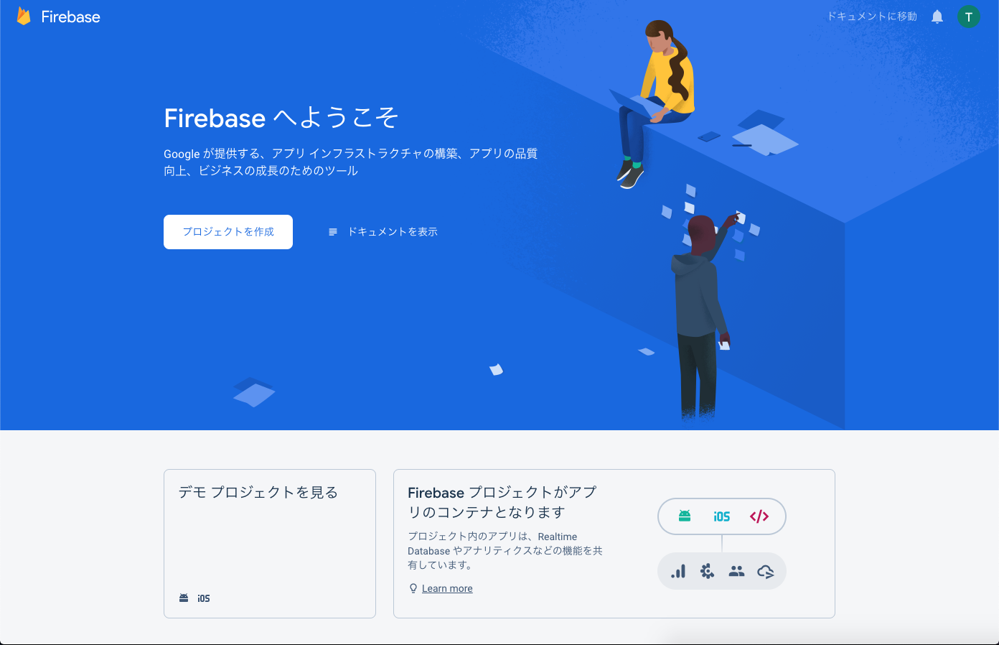</td>
        </tr>
        <tr>
            <td>プロジェクト名を入力し続行</td>
            <td width="50%"></td>
        </tr>
        <tr>
            <td>続行</td>
            <td width="50%">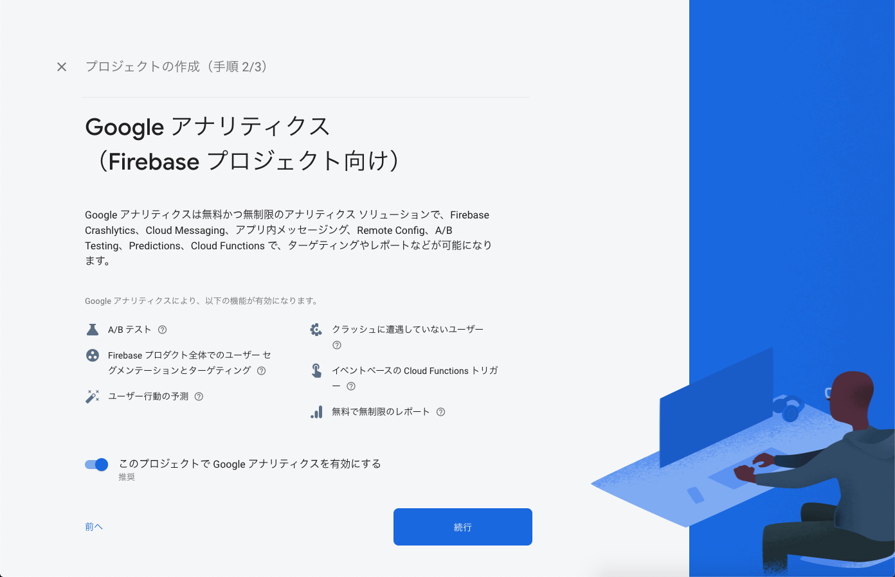</td>
        </tr>
        <tr>
            <td>地域と利用規約を確認しプロジェクト作成</td>
            <td width="50%">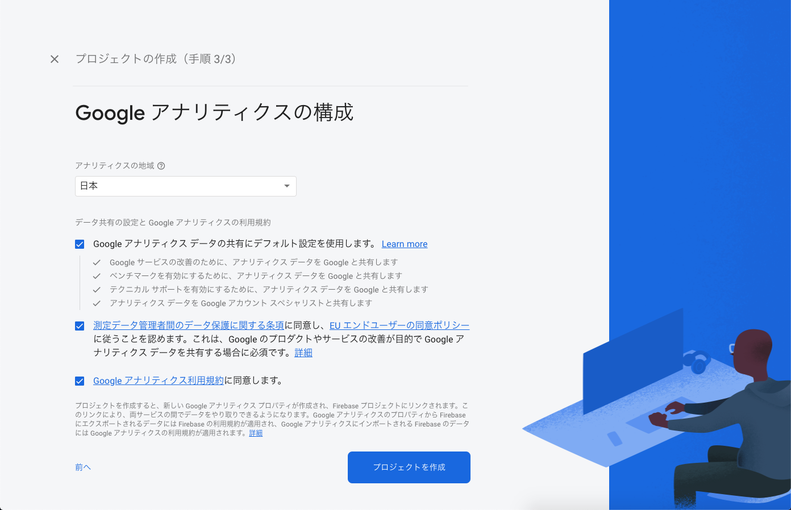</td>
        </tr>
        <tr>
            <td>準備ができたら続行</td>
            <td width="50%"></td>
        </tr>
        <tr>
            <td>プロジェクトが作成できました 🎉🎉🎉</td>
            <td width="50%"></td>
        </tr>
    </tbody>
</table>


### Authenticationの機能を有効化

プロジェクトが作成できたら、次はAuthenticationの機能を有効化してみましょう。  
ここでは、メール/パスワードでのログイン機能を設定してみます。

<table>
    <tbody>
        <tr>
            <td>サイドナビの「開発 → Authentication」を選択</td>
            <td width="50%"></td>
        </tr>
        <tr>
            <td>「Sign-in method」を選択</td>
            <td width="50%">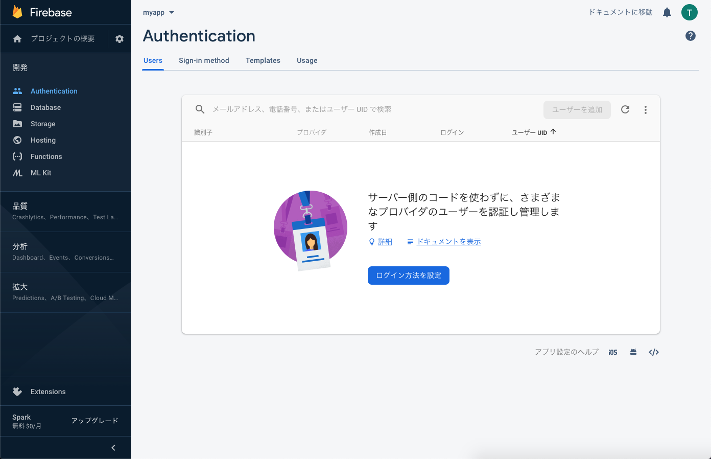</td>
        </tr>
        <tr>
            <td>「メール / パスワード」を選択</td>
            <td width="50%">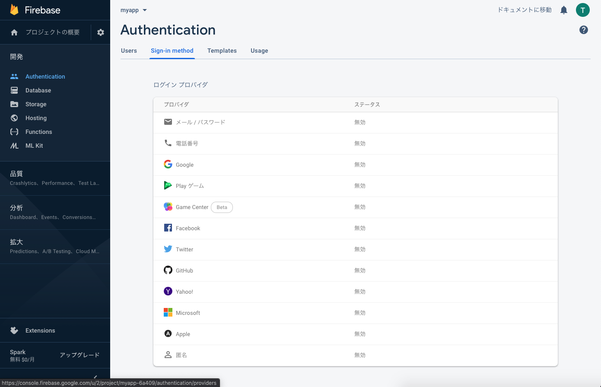</td>
        </tr>
        <tr>
            <td>「有効にする」をチェックし保存</td>
            <td width="50%">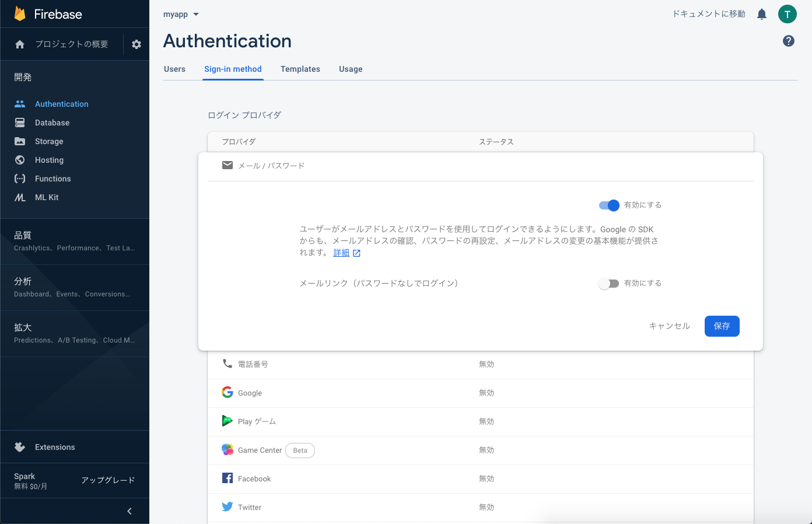</td>
        </tr>
        <tr>
            <td>ログイン機能が使えるようになりました 🎉🎉🎉</td>
            <td width="50%">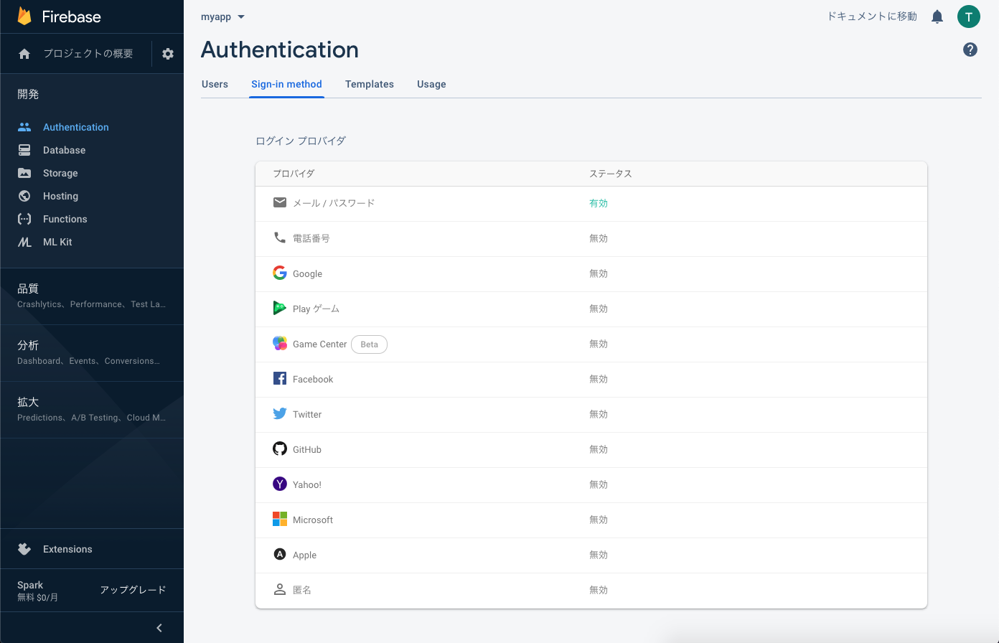</td>
        </tr>
    </tbody>
</table>


## Flutterプロジェクト作成・設定

無事、Authenticationを使うための準備はできたでしょうか？  
次は、Flutter側の準備も進めていきましょう。


### Flutterプロジェクト作成

[アプリ起動のページ](/getting-started/run-app)で紹介したのと同じ様に、  
Flutterのプロジェクトを作成し開発できる状態にしましょう。

```bash
$ flutter create myauth
```


### Webアプリ用セットアップ

ここではWebアプリ用にFirebaseと連携するための設定を行いましょう。

※ ここでは設定が簡単なWebアプリで開発を進めていきます。  
※ iOS/Androidで利用したい場合は、[ライブラリの説明](https://pub.dev/packages/firebase_auth)を元に別途設定する必要があります。

<table>
    <tbody>
        <tr>
            <td>FirebaseプロジェクトからWebアプリを追加</td>
            <td width="50%"></td>
        </tr>
        <tr>
            <td>アプリを登録</td>
            <td width="50%">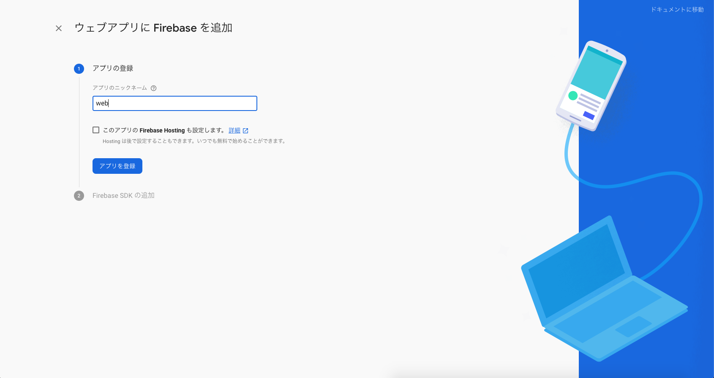</td>
        </tr>
        <tr>
            <td>
                ❗️ 注意 ❗️<br/>
                Authentication用のスクリプトも追加する必要があります。<br/>
                画像を参考に、web/index.html に設定を追記します。
            </td>
            <td width="50%">
                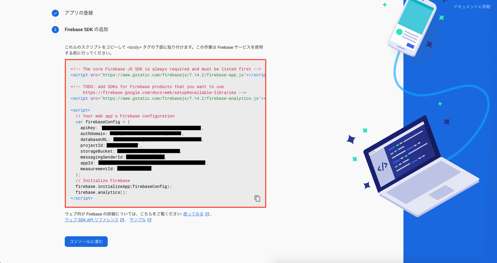<br/>
                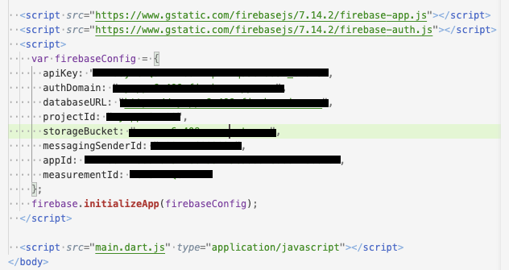
            </td>
        </tr>
        <tr>
            <td>準備OK 🎉🎉🎉</td>
            <td width="50%"></td>
        </tr>
    </tbody>
</table>


## ログイン機能を実装してみる

Authenticationを使ったログイン機能を実装していきましょう。


### Authentication用ライブラリをインストール

FlutterからAuthenticationを使うためのライブラリが提供されているので、  
インストールしましょう。

- https://pub.dev/packages/firebase_auth

作成したFlutterプロジェクトの `pubspec.yaml` を開き、  
`dependencies` に使用するライブラリを追記します。

```yaml
# --- 省略 ---

dependencies:
  flutter:
    sdk: flutter


  # The following adds the Cupertino Icons font to your application.
  # Use with the CupertinoIcons class for iOS style icons.
  cupertino_icons: ^0.1.3

  # *** ここを追記 ***
  firebase_auth: ^0.16.0

dev_dependencies:
  flutter_test:
    sdk: flutter

# --- 省略 ---
```

VSCodeのFlutterプラグインを使っている場合は、  
ファイルを保存すれば `pubspec.yaml` を元に自動的にライブラリをインストールしてくれるはずです。

もし、上手くインストールしてくれない場合は、以下のコマンドでもインストールできます。

```bash
$ flutter pub get
```


### ユーザー登録機能を実装

まずは、初回のユーザー登録を行う機能を実装してみます。  
`lib/main.dart` を以下のように書き換えましょう。  
少し長いですが頑張っていきましょう 💪💪💪

また、Authenticationの管理画面から登録ユーザー一覧が見れるので、  
ユーザー登録に成功したら、そちらも確認してみましょう

解説

- メールアドレス・パスワードを入力しユーザー登録を行う
    - `FirebaseAuth.createUserWithEmailAndPassword()` でユーザー登録を行う
    - ユーザー登録に成功するとユーザー情報が取得できる
- StateやTextField周りの処理がよく分からない場合は、前のページをおさらいしよう
    - [状態を持ったWidget](/widgets/state-widget)
    - [Todoリスト追加画面](/todo-app/add-page)

ソースコード

```dart
import 'package:firebase_auth/firebase_auth.dart';
import 'package:flutter/material.dart';

void main() {
  runApp(MyApp());
}

class MyApp extends StatelessWidget {
  // This widget is the root of your application.
  @override
  Widget build(BuildContext context) {
    return MaterialApp(
      debugShowCheckedModeBanner: false,
      title: 'Flutter Demo',
      theme: ThemeData(
        primarySwatch: Colors.blue,
        visualDensity: VisualDensity.adaptivePlatformDensity,
      ),
      home: MyAuthPage(),
    );
  }
}

class MyAuthPage extends StatefulWidget {
  @override
  _MyAuthPageState createState() => _MyAuthPageState();
}

class _MyAuthPageState extends State<MyAuthPage> {
  // 入力されたメールアドレス
  String newUserEmail = "";
  // 入力されたパスワード
  String newUserPassword = "";

  // 登録・ログインに関する情報を表示
  String infoText = "";

  @override
  Widget build(BuildContext context) {
    return Scaffold(
      body: Center(
        child: Container(
          padding: EdgeInsets.all(32),
          child: Column(
            children: <Widget>[
              TextFormField(
                // テキスト入力のラベルを設定
                decoration: InputDecoration(labelText: "メールアドレス"),
                onChanged: (String value) {
                  setState(() {
                    newUserEmail = value;
                  });
                },
              ),
              TextFormField(
                decoration: InputDecoration(labelText: "パスワード（６文字以上）"),
                // パスワードが見えないようにする
                obscureText: true,
                onChanged: (String value) {
                  setState(() {
                    newUserPassword = value;
                  });
                },
              ),
              RaisedButton(
                onPressed: () async {
                  try {
                    // メール/パスワードでユーザー登録
                    final FirebaseAuth auth = FirebaseAuth.instance;
                    final AuthResult result =
                        await auth.createUserWithEmailAndPassword(
                      email: newUserEmail,
                      password: newUserPassword,
                    );

                    // 登録したユーザー情報
                    final FirebaseUser user = result.user;
                    setState(() {
                      infoText = "登録OK：${user.email}";
                    });
                  } catch (e) {
                    // 登録に失敗した場合
                    setState(() {
                      infoText = "登録NG：${e.message}";
                    });
                  }
                },
                child: Text("ユーザー登録"),
              ),
              Text(infoText)
            ],
          ),
        ),
      ),
    );
  }
}
```

スクリーンショット

<table>
    <thead>
        <tr>
            <th>ユーザー登録</th>
            <th>ユーザー一覧</th>
        </tr>
    </thead>
    <tbody>
        <tr>
            <td>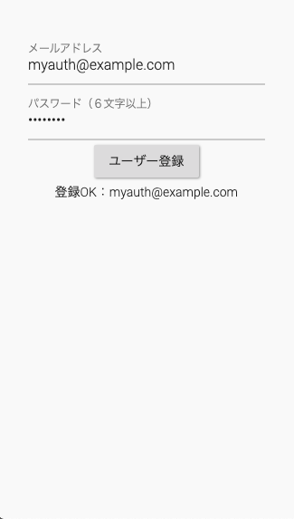</td>
            <td width="70%">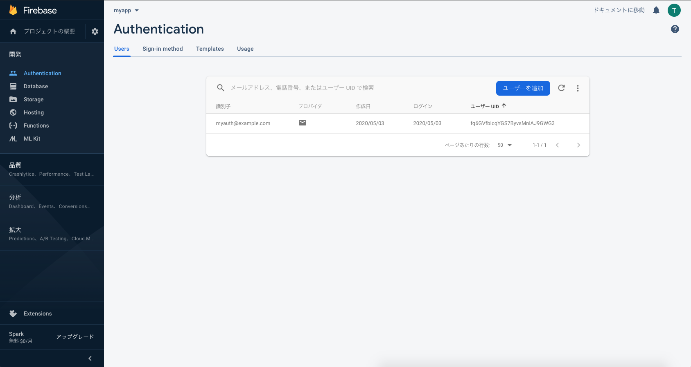</td>
        </tr>
    </tbody>
</table>


### ログイン機能を実装

次は、ユーザー登録したメールアドレスとパスワードを使って  
ログインする機能を実装してみましょう。

`lib/main.dart` を以下のように書き換えましょう。

解説

- メールアドレス・パスワードを入力しログインを行う
    - `FirebaseAuth.signInWithEmailAndPassword()` でログインを行う
    - ログインに成功するとユーザー情報が取得できる

ソースコード

```dart
/* --- 省略 --- */

class _MyAuthPageState extends State<MyAuthPage> {
  // 入力されたメールアドレス
  String newUserEmail = "";
  // 入力されたパスワード
  String newUserPassword = "";

  // 入力されたメールアドレス（ログイン）
  String loginUserEmail = "";
  // 入力されたパスワード（ログイン）
  String loginUserPassword = "";

  // 登録・ログインに関する情報を表示
  String infoText = "";

  @override
  Widget build(BuildContext context) {
    return Scaffold(
      body: Center(
        child: Container(
          padding: EdgeInsets.all(32),
          child: Column(
            children: <Widget>[
              TextFormField( /* --- 省略 --- */ ),
              TextFormField( /* --- 省略 --- */ ),
              RaisedButton( /* --- 省略 --- */ ),
              Container(height: 32),
              TextFormField(
                decoration: InputDecoration(labelText: "メールアドレス"),
                onChanged: (String value) {
                  setState(() {
                    loginUserEmail = value;
                  });
                },
              ),
              TextFormField(
                decoration: InputDecoration(labelText: "パスワード"),
                obscureText: true,
                onChanged: (String value) {
                  setState(() {
                    loginUserPassword = value;
                  });
                },
              ),
              RaisedButton(
                onPressed: () async {
                  try {
                    // メール/パスワードでログイン
                    final FirebaseAuth auth = FirebaseAuth.instance;
                    final AuthResult result =
                        await auth.signInWithEmailAndPassword(
                      email: loginUserEmail,
                      password: loginUserPassword,
                    );
                    // ログインに成功した場合
                    final FirebaseUser user = result.user;
                    setState(() {
                      infoText = "ログインOK：${user.email}";
                    });
                  } catch (e) {
                    // ログインに失敗した場合
                    setState(() {
                      infoText = "ログインNG：${e.message}";
                    });
                  }
                },
                child: Text("ログイン"),
              ),
              Text(infoText),
            ],
          ),
        ),
      ),
    );
  }
}
```

スクリーンショット

<table>
    <thead>
        <tr>
            <th>ログインに成功した場合</th>
            <th>ログインに失敗した場合</th>
        </tr>
    </thead>
    <tbody>
        <tr>
            <td>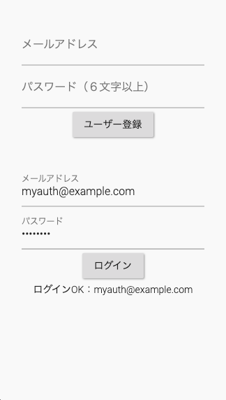</td>
            <td width="50%">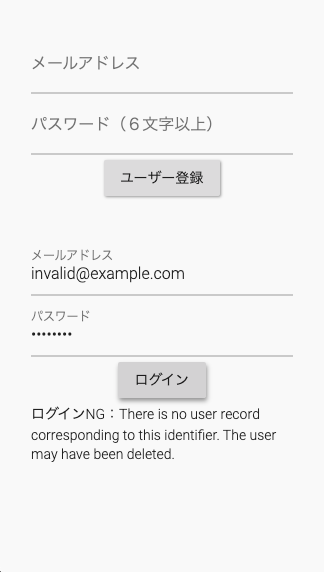</td>
        </tr>
    </tbody>
</table>


### ログイン機能が実装できました

ユーザー登録・ログイン機能が実装できました 🎉🎉🎉

設定周りなど面倒くさく感じてしまう部分もあったかと思いますが、  
ログイン機能の処理自体はすごく簡単に実装できましたよね。

Authenticationを使うことで、  
サーバー側やアプリ側で複雑な処理を実装する必要がなくなり、  
簡単かつ安全なログイン機能を実装できるのです ⚡️

この他にもAuthenticationには機能があるので  
気になる方は公式サイトを確認してみて下さい 👀

- https://pub.dev/packages/firebase_auth
- https://firebase.google.com/docs/auth


## まとめ

- Authenticationはユーザーを簡単かつ安全に認証する仕組みを提供するもの
- Authenticationを使う際は事前に設定を行う必要がある
- ライブラリを使いログイン機能を簡単に実装できる

次回は、Cloud Firestoreの概要を紹介していきます 💪💪💪


## 参考情報

- https://pub.dev/packages/firebase_auth
- https://firebase.google.com/docs/auth
- https://firebase.google.com/docs/web/setup