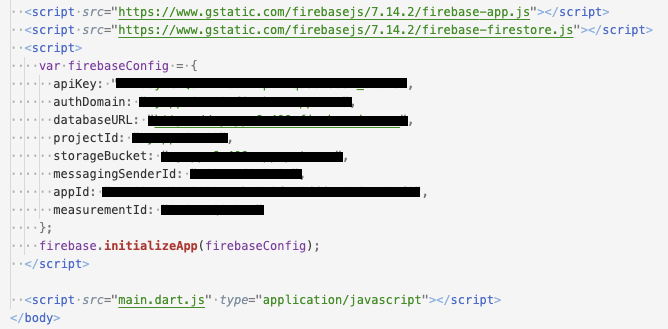
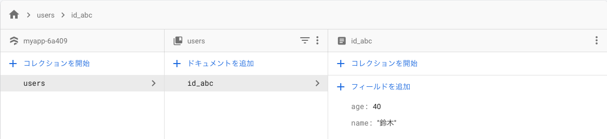
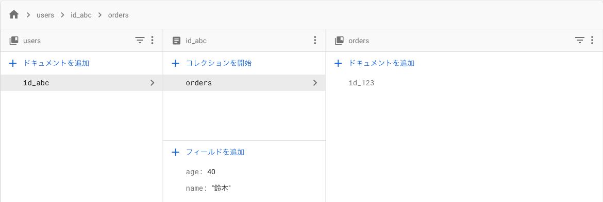

## このページのゴール

- Cloud Firestoreでの作成・取得・更新・削除方法を知る
- FlutterからCloud Firestoreを操作する方法を知る


## Flutterプロジェクト作成・設定

無事、Cloud Firestoreを使うための準備はできたでしょうか？  
次は、Flutter側の準備も進めていきましょう。


### Flutterプロジェクト作成

[アプリ起動のページ](/getting-started/run-app)で紹介したのと同じ様に、  
Flutterのプロジェクトを作成し開発できる状態にしましょう。

```bash
$ flutter create myapp
```


### Webアプリ用セットアップ

ここではWebアプリ用にFirebaseと連携するための設定を行いましょう。

※ ここでは設定が簡単なWebアプリで開発を進めていきます。  
※ iOS/Androidで利用したい場合は、[ライブラリの説明](https://pub.dev/packages/firebase_auth)を元に別途設定する必要があります。


<table>
    <tbody>
        <tr>
            <td>FirebaseプロジェクトからWebアプリを追加</td>
            <td width="50%"></td>
        </tr>
        <tr>
            <td>アプリを登録</td>
            <td width="50%"></td>
        </tr>
        <tr>
            <td>
                ❗️ 注意 ❗️<br/>
                Firestore用のスクリプトも追加する必要があります。<br/>
                画像を参考に、web/index.html に設定を追記します。
            </td>
            <td width="50%">
                <br/>
                
            </td>
        </tr>
        <tr>
            <td>準備OK 🎉🎉🎉</td>
            <td width="50%"></td>
        </tr>
    </tbody>
</table>


## Firestoreを使った処理を実装してみる

Cloud Firestoreを使った処理を実装していきましょう。


### ❗️ 注意事項 ❗️  
Webアプリ向けの設定を行ったので、  
起動するデバイスは `Chrome` を選択して下さい。


### Firestore用ライブラリをインストール

FlutterからCloud Firestoreを使うためのライブラリが提供されているので、  
インストールしましょう。

- https://pub.dev/packages/cloud_firestore

作成したFlutterプロジェクトの `pubspec.yaml` を開き、  
`dependencies` に使用するライブラリを追記します。

```yaml
# --- 省略 ---

dependencies:
  flutter:
    sdk: flutter


  # The following adds the Cupertino Icons font to your application.
  # Use with the CupertinoIcons class for iOS style icons.
  cupertino_icons: ^0.1.3

  # *** ここを追記 ***
  cloud_firestore: ^0.13.5

dev_dependencies:
  flutter_test:
    sdk: flutter

# --- 省略 ---
```

VSCodeのFlutterプラグインを使っている場合は、  
ファイルを保存すれば `pubspec.yaml` を元に自動的にライブラリをインストールしてくれるはずです。

もし、上手くインストールしてくれない場合は、以下のコマンドでもインストールできます。

```bash
$ flutter pub get
```


### ドキュメントを作成

ドキュメントを作成する処理を実装してみましょう。  
`lib/main.dart` を以下のように書き換えましょう。

解説

- `setData()` でドキュメントを作成できる
- コレクションが存在しない場合は自動的に作成される
- 作成されたドキュメントはFirestoreの管理画面で確認できる

ドキュメント



ソースコード

```dart
import 'package:cloud_firestore/cloud_firestore.dart';
import 'package:flutter/material.dart';

void main() {
  runApp(MyApp());
}

class MyApp extends StatelessWidget {
  @override
  Widget build(BuildContext context) {
    return MaterialApp(
      debugShowCheckedModeBanner: false,
      title: 'Flutter Demo',
      theme: ThemeData(
        primarySwatch: Colors.blue,
        visualDensity: VisualDensity.adaptivePlatformDensity,
      ),
      home: MyFirestorePage(),
    );
  }
}

class MyFirestorePage extends StatefulWidget {
  @override
  _MyFirestorePageState createState() => _MyFirestorePageState();
}

class _MyFirestorePageState extends State<MyFirestorePage> {
  @override
  Widget build(BuildContext context) {
    return Scaffold(
      body: Center(
        child: Column(
          children: <Widget>[
            RaisedButton(
              child: Text('コレクション＋ドキュメント作成'),
              onPressed: () async {
                // ドキュメント作成
                await Firestore.instance
                    .collection('users') // コレクションID
                    .document('id_abc') // ドキュメントID
                    .setData({'name': '鈴木', 'age': 40}); // データ
              },
            ),
          ],
        ),
      ),
    );
  }
}
```

### サブコレクションにドキュメントを作成

次は、作成したドキュメント紐付いた  
サブコレクションとドキュメントを作成してみましょう。

`lib/main.dart` の `_MyFirestorePageState` を以下のように書き換えましょう。

解説

- サブコレクションを作成する時は紐付けるドキュメントのIDも指定する
- サブコレクションが存在しない場合は自動的に作成される
- 作成されたドキュメントはFirestoreの管理画面で確認できる

ドキュメント



ソースコード

```dart
class _MyFirestorePageState extends State<MyFirestorePage> {
  @override
  Widget build(BuildContext context) {
    return Scaffold(
      body: Center(
        child: Column(
          children: <Widget>[
            RaisedButton( /* --- 省略 --- */ ),
            RaisedButton(
              child: Text('サブコレクション＋ドキュメント作成'),
              onPressed: () async {
                // サブコレクション内にドキュメント作成
                await Firestore.instance
                    .collection('users') // コレクションID
                    .document('id_abc') // ドキュメントID << usersコレクション内のドキュメント
                    .collection('orders') // サブコレクションID
                    .document('id_123') // ドキュメントID << サブコレクション内のドキュメント
                    .setData({'price': 600, 'date': '9/13'}); // データ
              },
            ),
          ],
        ),
      ),
    );
  }
}
```


### ドキュメント一覧を取得

次は、作成したドキュメントの情報を取得し、  
`users` コレクション内のドキュメント一覧を表示してみましょう。

`lib/main.dart` の `_MyFirestorePageState` を以下のように書き換えましょう。

解説

- `getDocuments()` でコレクション内のドキュメント一覧を取得できる

ソースコード

```dart
class _MyFirestorePageState extends State<MyFirestorePage> {

  // 作成したドキュメント一覧
  List<DocumentSnapshot> documentList = [];

  @override
  Widget build(BuildContext context) {
    return Scaffold(
      body: Center(
        child: Column(
          children: <Widget>[
            RaisedButton( /* --- 省略 --- */ ),
            RaisedButton( /* --- 省略 --- */ ),
            RaisedButton(
              child: Text('ドキュメント一覧取得'),
              onPressed: () async {
                // コレクション内のドキュメント一覧を取得
                final snapshot =
                    await Firestore.instance.collection('users').getDocuments();
                // 取得したドキュメント一覧をUIに反映
                setState(() {
                  documentList = snapshot.documents;
                });
              },
            ),
            // コレクション内のドキュメント一覧を表示
            Column(
              children: documentList.map((document) {
                return ListTile(
                  title: Text('${document['name']}さん'),
                  subtitle: Text('${document['age']}歳'),
                );
              }).toList(),
            ),
          ],
        ),
      ),
    );
  }
}
```


### ドキュメントを指定して取得

一覧ではなく、1つだけドキュメントを取得したい場合もありますよね。  
作成したサブコレクション内のドキュメント `id_123` を指定して表示してみましょう。

`lib/main.dart` の `_MyFirestorePageState` を以下のように書き換えましょう。

解説

- コレクションID・ドキュメントIDを指定し `get` で特定のドキュメントを取得できる

ソースコード

```dart
class _MyFirestorePageState extends State<MyFirestorePage> {
  // 作成したドキュメント一覧
  List<DocumentSnapshot> documentList = [];

  // 指定したドキュメントの情報
  String orderDocumentInfo = '';

  @override
  Widget build(BuildContext context) {
    return Scaffold(
      body: Center(
        child: Column(
          children: <Widget>[
            RaisedButton( /* --- 省略 --- */ ),
            RaisedButton( /* --- 省略 --- */ ),
            RaisedButton( /* --- 省略 --- */ ),
            Column( /* --- 省略 --- */ ),
            RaisedButton(
              child: Text('ドキュメントを指定して取得'),
              onPressed: () async {
                // コレクションIDとドキュメントIDを指定して取得
                final document = await Firestore.instance
                    .collection('users')
                    .document('id_abc')
                    .collection('orders')
                    .document('id_123')
                    .get();
                // 取得したドキュメントの情報をUIに反映
                setState(() {
                  orderDocumentInfo =
                      '${document['date']} ${document['price']}円';
                });
              },
            ),
            // ドキュメントの情報を表示
            ListTile(title: Text(orderDocumentInfo)),
          ],
        ),
      ),
    );
  }
}
```


### ドキュメントを更新

次は、作成したドキュメントの情報を更新してみましょう。  
ここでは、鈴木さんの年齢 `age` を `40` から `41` に変えてみましょう。

`lib/main.dart` の `MyFirestorePage` を以下のように書き換えましょう。

解説

- `updateData()` でドキュメントのデータを更新できる
- 管理画面を確認したり、ドキュメント一覧を再取得するとドキュメントが更新されている

ドキュメント


ソースコード

```dart
class _MyFirestorePageState extends State<MyFirestorePage> {
  /* --- 省略 --- */
  @override
  Widget build(BuildContext context) {
    return Scaffold(
      body: Center(
        child: Column(
          children: <Widget>[
            RaisedButton( /* --- 省略 --- */ ),
            RaisedButton( /* --- 省略 --- */ ),
            RaisedButton( /* --- 省略 --- */ ),
            Column( /* --- 省略 --- */ ),
            RaisedButton( /* --- 省略 --- */ ),
            ListTile( /* --- 省略 --- */ ),
            RaisedButton(
              child: Text('ドキュメント更新'),
              onPressed: () async {
                // ドキュメント更新
                await Firestore.instance
                    .collection('users')
                    .document('id_abc')
                    .updateData({'age': 41});
              },
            ),
          ],
        ),
      ),
    );
  }
}
```


### ドキュメントを削除

最後に、ドキュメントの削除を行います。  
ここでは、ドキュメント `id_123` を削除してみましょう。

解説

- `delete()` でドキュメントを削除できる
- 管理画面を確認するとドキュメントが削除されている

ドキュメント


ソースコード

```dart
class _MyFirestorePageState extends State<MyFirestorePage> {
  /* --- 省略 --- */
  @override
  Widget build(BuildContext context) {
    return Scaffold(
      body: Center(
        child: Column(
          children: <Widget>[
            RaisedButton( /* --- 省略 --- */ ),
            RaisedButton( /* --- 省略 --- */ ),
            RaisedButton( /* --- 省略 --- */ ),
            Column( /* --- 省略 --- */ ),
            RaisedButton( /* --- 省略 --- */ ),
            ListTile( /* --- 省略 --- */ ),
            RaisedButton( /* --- 省略 --- */ ),
            RaisedButton(
              child: Text('ドキュメント削除'),
              onPressed: () async {
                // ドキュメント削除
                await Firestore.instance
                    .collection('users')
                    .document('id_abc')
                    .collection('orders')
                    .document('id_123')
                    .delete();
              },
            ),
          ],
        ),
      ),
    );
  }
}
```


## まとめ

- ライブラリを使いFirestoreを使った機能を簡単に実装できる

お疲れさまでした 👏  
Authenticationに続きCloud Firestoreの扱い方も学びましたね。

次回からはFirebaseを使った  
少し複雑なアプリ開発にチャレンジしてみましょう 💪💪💪

## 参考情報

- https://pub.dev/packages/cloud_firestore
