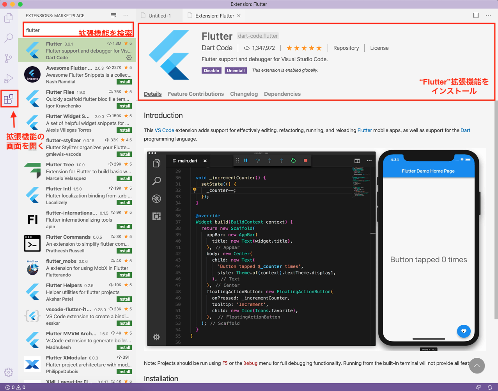

## このページのゴール

- VSCodeでFlutter開発環境を設定する


## エディタ

Flutterを開発するためには **Android Studio (IntelliJ) または Visual Studio Code** を使います。  
本サイトでは **Visual Studio Code を使って開発**していきましょう 💪

※ Android Studio（IntelliJ）を使ってもらっても全然OKですが、  
やや癖のあるエディタなので、**普段使っていない方はVSCodeの利用がおすすめ**です。


## VSCodeを使う

### VSCodeをインストール

<a
    className="btn-link"
    href="https://code.visualstudio.com/">
    https://code.visualstudio.com/
</a>


### Flutterの拡張機能をインストール

VSCodeを起動し[Flutterの拡張機能](https://marketplace.visualstudio.com/items?itemName=Dart-Code.flutter)をインストールしましょう。  
この拡張機能をインストールすることでFlutterの開発に対応させることが出来るのです。



### 正しく設定できてるか確認

`flutter doctor`で設定状況が確認できます。  
VS Codeのところに ✅ が入っていればOK 👍

```bash
$ flutter doctor
...
[✓] VS Code (version 1.54.2)
...
```


## まとめ

- Flutter用のエディタとして Android Studio (IntelliJ) と VS Code が選択できる
- VS Code に 拡張機能をインストールするだけでOK 🚀

エディタの設定が完了しましたね、次はお待ちかねのアプリ起動です 🚀🤩


## 参考情報

- https://flutter.dev/docs/get-started/editor?tab=vscode
