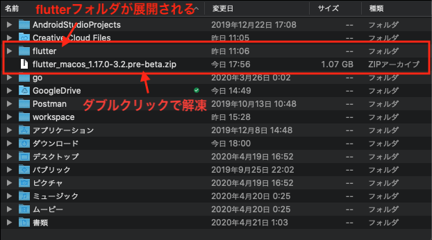
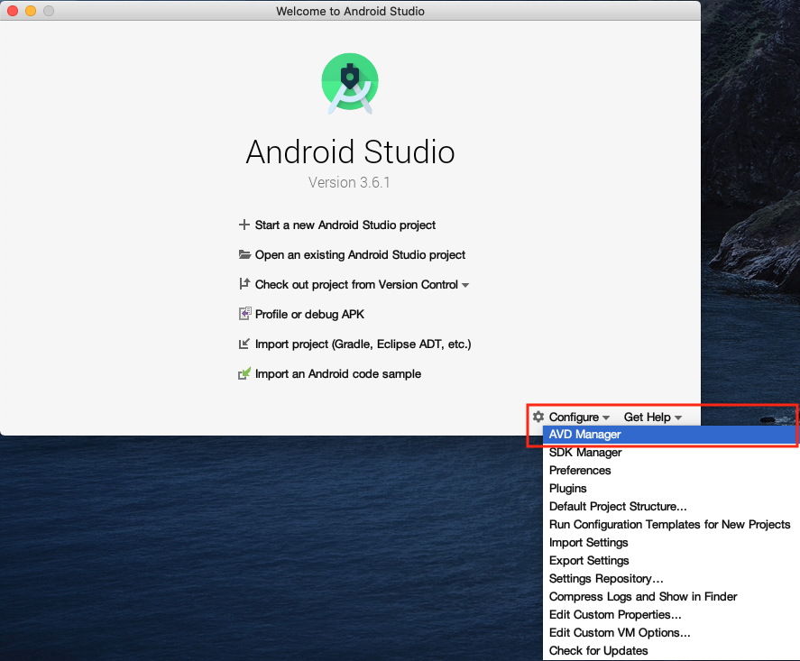
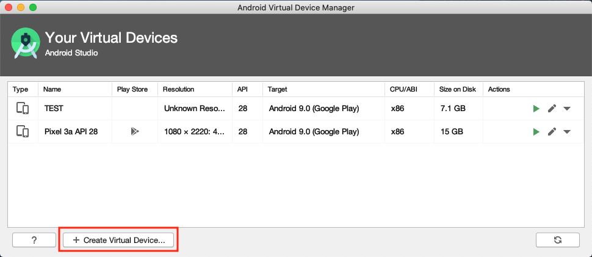
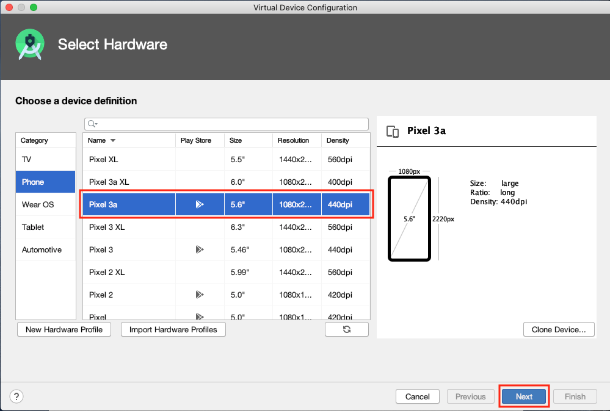
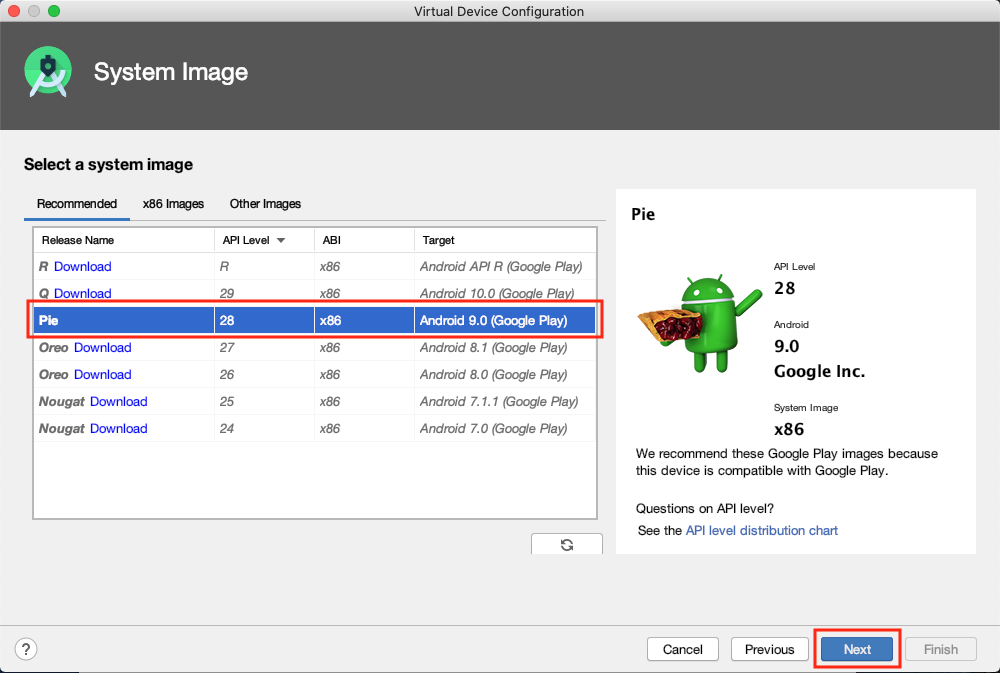
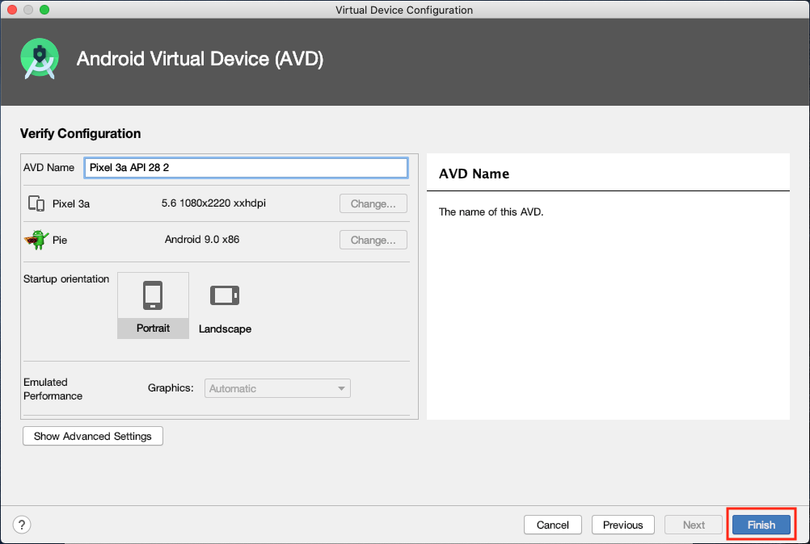
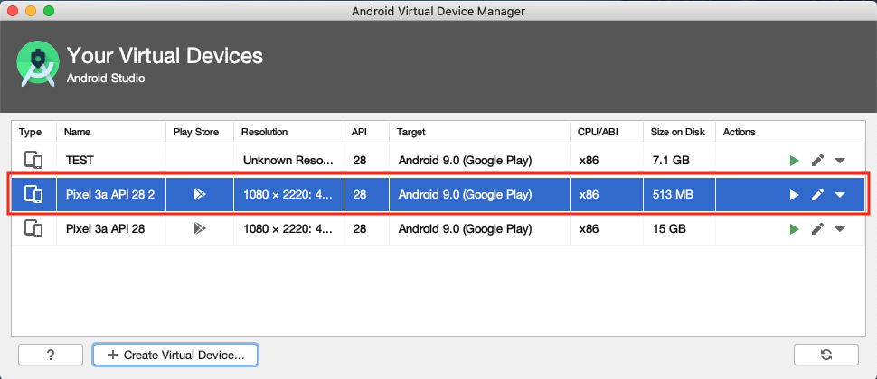
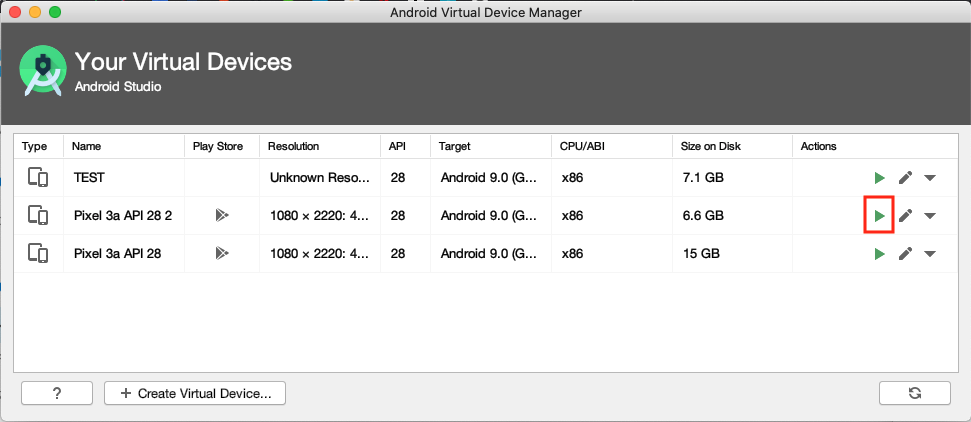

## このページのゴール
- Flutterをインストールする
- iOS/Android/Webの開発環境を設定する

## インストールの流れ

早速インストールを進めていきましょう 🔧🔧🔧

### ステップ

1. Flutterをインストール
1. iOS開発環境を設定
1. Android開発環境を設定
1. Web開発環境を設定

### 注意事項

- 本サイトでは基本的に**Macを使用することを前提**としています。


## 1. Flutterをインストール

### Flutterをダウンロードしホームディレクトリに保存

👉 [flutter_macos_1.17.0-3.2.pre-beta.zip](https://storage.googleapis.com/flutter_infra/releases/beta/macos/flutter_macos_1.17.0-3.2.pre-beta.zip)

### ダウンロードしたファイルを解凍



### Flutterにパスを通す

ログインシェルの設定ファイルにパスの情報を追記

```text
// .bash_profile または .zprofile に追記
export PATH="$PATH:$HOME/flutter/bin"
```

※ 使っているシェルを確認する  👉 `echo $SHELL`
- `bash`を使っている場合 👉 `~/.bash_profile`
- `zsh`を使っている場合 👉 `~/.zprofile`

### Flutterにパスが通っているか確認

バージョン情報が表示されればOK 👍

```bash
$ flutter --version
Flutter 1.17.0-3.2.pre • channel beta • https://github.com/flutter/flutter.git
Framework • revision 2a7bc389f2 (4 days ago) • 2020-04-21 20:34:20 -0700
Engine • revision 4c8c31f591
Tools • Dart 2.8.0 (build 2.8.0-dev.20.10)
```

### ※ コマンドラインからやりたい方はこちら

```bash
$ cd ~
$ curl -O https://storage.googleapis.com/flutter_infra/releases/beta/macos/flutter_macos_1.17.0-3.2.pre-beta.zip
$ unzip ./flutter_macos_1.17.0-3.2.pre-beta.zip
// bashを使っている場合
$ echo 'export PATH="$PATH:$HOME/flutter/bin"' >> ~/.bash_profile
// zshを使っている場合
$ echo 'export PATH="$PATH:$HOME/flutter/bin"' >> ~/.zprofile
$ flutter --version
```


## 2. iOS開発環境を設定

### Xcodeをインストール

👉 https://apps.apple.com/us/app/xcode/id497799835

### コマンドラインツールを設定

```bash
$ sudo xcode-select --switch /Applications/Xcode.app/Contents/Developer
$ sudo xcodebuild -license
```

### シミュレータを起動

```bash
$ open -a Simulator
```

### 正しく設定できてるか確認

`flutter doctor`で設定状況が確認できます。  
Xcodeのところに ✅ が入っていればOK 👍

```bash
$ flutter doctor
...
[✓] Xcode - develop for iOS and macOS (Xcode 11.3.1)
...
```


## 3. Android開発環境を設定

### Android Studioをインストール

👉 https://developer.android.com/studio

### エミュレータを作成

Android Studio を起動し `Configure >> AVD Manager` からエミュレータを作成

<details><summary>手順詳細</summary>
    
    
    
    
    
    
</details>

### エミュレータを起動

Android Studio を起動し `Configure >> AVD Manager` からエミュレータを起動



### 正しく設定できてるか確認

`flutter doctor`で設定状況が確認できます。  
Android toolchainのところに ✅ が入っていればOK 👍

```bash
$ flutter doctor
...
[✓] Android toolchain - develop for Android devices (Android SDK version 29.0.2)
...
```


## 4. Web開発環境を設定

### Webを有効化

```bash
$ flutter config --enable-web
```

### Chromeをインストール

👉 https://www.google.com/chrome/

### 正しく設定できてるか確認

`flutter doctor`で設定状況が確認できます。  
Chromeのところに ✅ が入っていればOK 👍

```bash
$ flutter doctor
...
[✓] Chrome - develop for the web
...
```


## まとめ

- Flutterをダウンロードしパスを通すことでインストール完了 👍
- iOS/Android/Webの設定状況は `flutter doctor` で確認 👍

環境設定お疲れさまでした。  
次はエディタの設定です、アプリを起動するまでもう少しなので頑張りましょう 💪


## 参考情報

- https://flutter.dev/docs/get-started/install/macos
