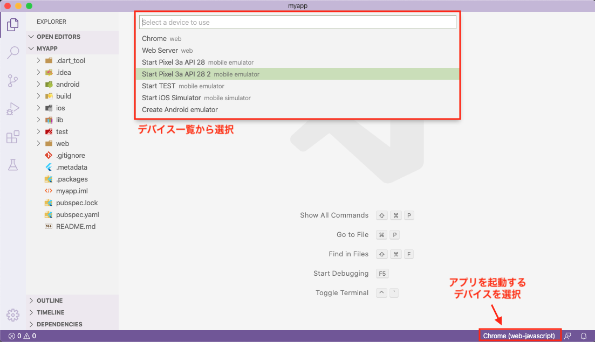
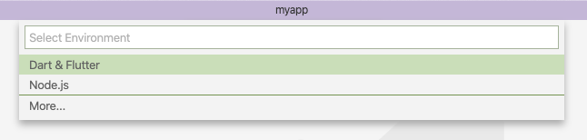
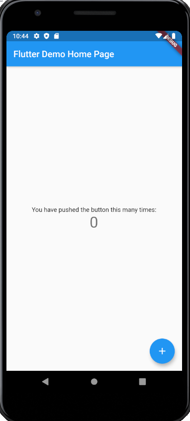

## このページのゴール

- プロジェクトを作成する
- アプリを起動する


## Flutterプロジェクトを作成

コマンドラインからFlutterのプロジェクト雛形を簡単に作成できます  
今回は `myapp` という名前のプロジェクトを作ってみましょう 😀

```bash
$ flutter create myapp
```


## アプリを起動するには

作成した `myapp` プロジェクトのアプリを起動してみましょう。  
アプリの起動は **VSCode と コマンドライン どちらからでも可能**です


## VSCodeでアプリ起動

VSCodeを起動し `File >> Open` から作成したプロジェクトのディレクトリ選択。  
プロジェクトを開いたら、右下のデバイス名をクリックし起動するデバイスを選択。  
今回は事前に作成したAndroidのエミュレータを選択してみましょう。



最後に、ショートカット`F5`でアプリを起動してみましょう



指定したデバイスでアプリが起動できました 🤩



## コマンドラインでアプリ起動

`flutter devices` で起動しているデバイス一覧が確認できます。

```bash
$ flutter devices
3 connected devices:

AOSP on IA Emulator • emulator-5554 • android-x86    • Android 9 (API 28) (emulator)
Chrome              • chrome        • web-javascript • Google Chrome 81.0.4044.122
Web Server          • web-server    • web-javascript • Flutter Tools
```

`flutter run` でアプリを起動できます。  
今回は事前に作成したAndroidのエミュレータを指定してアプリを起動してみましょう。

```bash
$ flutter run --device-id emulator-5554
...

Flutter run key commands.
r Hot reload. 🔥🔥🔥
R Hot restart.
h Repeat this help message.
d Detach (terminate "flutter run" but leave application running).
c Clear the screen
q Quit (terminate the application on the device).
An Observatory debugger and profiler on AOSP on IA Emulator is available at: http://127.0.0.1:65260/o7Jpjhs32WI=/
```

指定したデバイスでアプリが起動できました 🤩


## まとめ

- コマンドラインからプロジェクトを作成できる
- VSCodeまたはコマンドラインからアプリを起動できる

無事アプリを起動できたでしょうか？ 🤔  
次は、様々なUIを作るためのWidgetについて紹介していきます 💪💪💪


## 参考情報

- https://flutter.dev/docs/get-started/test-drive?tab=vscode
- https://flutter.dev/docs/get-started/test-drive?tab=terminal
