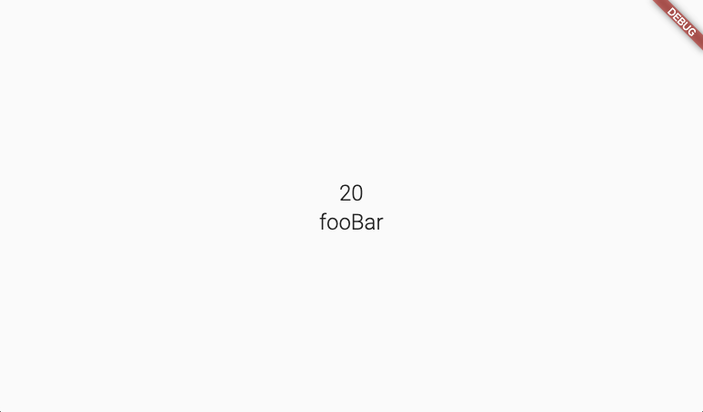

## Flutter on the web

FlutterはiOS/Androidアプリへの対応に加え、Webアプリもサポートしている。  
つまり、1つのFlutterのソースコードでiOS/AndroidアプリもWebアプリも同時に作れるのである。

~~2020年5月時点ではβ版ではあるものの~~、  
今までの公開の流れを見るとかなりのスピードで開発が進められていることを伺える。

※ 2021年3月にFlutter2となり、WebもStableな機能となりました。

- Flutter Live 2018 にて初披露
- Google I/O 2019 にてテクニカルプレビュー版として公開
- Flutter Interact 2019 にてβ版として公開

ここでは、そんな Flutter on the web に関して深堀りしていきたいと思う。

https://www.youtube.com/watch?v=ukLBCRBlIkk


## Flutter on the web の仕組み

まず、FlutterでWebアプリを作った際にどの様にアプリとして動かしているのだろうか？  
答えはシンプルで**DartからJavaScriptに変換したコードをブラウザ上で動かしている**のである。

DartからJavaScriptに変換する処理自体はDartの機能である。

**FlutterとしてはiOS/Androidと同じ様なUIのWidgetになるよう、  
HTML・Canvas・CSS辺りを使って上手く実現している**のです。

なので、Flutterを使ったiOS/Androidアプリとは異なり、  
DartVM上で動作しているとか、  
DartVMとiOS/Android間で専用チャネルを介した通信を行うといった仕組みは無いのです。


## Dart Web

DartにはDartで書かれたソースコードをJavaScriptに変換する仕組みが提供されている。  
この変換する際に用いるのが `dartdevc` と `dart2js` である。

- dartdevc
    - the Dart dev compiler
    - 開発用
    - 差分ビルドが行える
- dart2js
    - Dart-to-JavaScript compiler
    - 本番用

では、実際に Dart Web の機能を使ってWebアプリを作ってみたいと思います。

```bash
$ dart --version
Dart VM version: 2.7.2 (Mon Mar 23 22:11:27 2020 +0100) on "macos_x64"

// DartからJavaScriptへの変換処理を行うためのツール
$ pub global activate webdev

// プロジェクト作成
$ mkdir dartwebapp
$ cd dartwebapp
$ vi pubspec.yaml
name: dartwebapp
description: Dart web application
environment:
  sdk: '>=2.7.0 <3.0.0'
dev_dependencies:
  # dependencies for webdev
  build_runner: ^1.8.1
  build_test: ^0.10.12+1
  build_web_compilers: ^2.9.0

$ vi web/index.html
<!DOCTYPE html>
<html lang="ja">
<head>
    <meta charset="UTF-8">
    <meta name="viewport" content="width=device-width, initial-scale=1.0">
    <title>dartwebapp</title>
    <!-- JavaScriptに変換されたmain.dartを読み込む -->
    <script defer src="main.dart.js"></script>
</head>
<body>
    <div id="hello"></div>
</body>
</html>

$ vi web/main.dart
import 'dart:html';

void main() {
  querySelector('#hello').text = 'Hello World!!';
}

// Webアプリケーション起動（開発用）
$ pub global run webdev serve
...
[INFO] Serving `web` on http://127.0.0.1:8080
...

// ビルド（本番用）
$ pub global run webdev build --release
```


## Flutter on the web における描画処理

Flutter on the web ではDartのJavaScript変換機能を使うのと同時に、  
同じWidgetであればiOS/Android・Webどちらでも同じUIになるよう  
HTML・Canvas・CSSを使い描画処理を行っています。

もう少し詳しく見てみると、大きく分けて2パターンの描画方法があります。

1. HTML・CSSを使った描画方法
    - HTML・CSSのみで描画可能な場合に採用される
    - `<flt-dom-canvas>` タグとして描画される
    - これを内部的には `DomCanvas` と呼んでいる
1. Canvasを使った描画方法
    - HTML・CSSのみで描画できない場合に採用される
    - `<flt-canvas>` タグとして描画される
    - これを内部的には `BitmapCanvas` と呼んでいる

では、実際にどの様に使われているのかコードを確認してみましょう。

Flutterソースコード（Dart）
```dart
import 'package:flutter/material.dart';

void main() => runApp(MyApp());

class MyApp extends StatelessWidget {
  @override
  Widget build(BuildContext context) {
    return MaterialApp(
      title: 'Flutter Demo',
      debugShowCheckedModeBanner: false,
      theme: ThemeData(
        primarySwatch: Colors.blue,
      ),
      home: Scaffold(
        appBar: AppBar(
          leading: FlutterLogo(),
        ),
        body: Center(
          child: Text('Hello World'),
        ),
      ),
    );
  }
}
```

FlutterでビルドしたWebアプリのDOM（抜粋）
```html
<flt-scene flt-layer-state="updated" style="position: absolute;">
    <flt-transform
        flt-layer-state="updated"
        style="position: absolute; transform-origin: 0px 0px 0px;">
        <flt-offset
            flt-layer-state="retained"
            style="position: absolute; transform-origin: 0px 0px 0px; transform: translate(0px, 0px);">
            <flt-offset
                flt-layer-state="retained"
                style="position: absolute; transform-origin: 0px 0px 0px; transform: translate(0px, 0px);">
                <flt-clip
                    flt-layer-state="retained"
                    clip-type="physical-shape"
                    style="position: absolute; overflow: hidden; background-color: rgb(250, 250, 250); box-shadow: none; left: 0px; top: 0px; width: 552px; height: 815px; border-radius: 0px;">
                    <flt-clip-interior style="position: absolute; left: 0px; top: 0px;">
                        <flt-picture flt-layer-state="retained" style="position: absolute; transform: translate(0px, 0px);">

                            <!-- HTML&CSSのみで描画できる場合 → HTML&CSSを使う （DomCanvas） -->
                            <flt-dom-canvas style="position: absolute; top: 0px; right: 0px; bottom: 0px; left: 0px;">
                                <!-- Scaffold.body -->
                                <p style="font-size: 14px; font-weight: normal; font-family: Roboto, Arial, sans-serif; color: rgba(0, 0, 0, 0.867); position: absolute; white-space: pre-wrap; overflow-wrap: break-word; overflow: hidden; height: 16px; width: 72px; transform-origin: 0px 0px 0px; transform: matrix(1, 0, 0, 1, 240, 427.5);">Hello World</p>
                            </flt-dom-canvas>
                        </flt-picture>
                        <flt-clip
                            flt-layer-state="retained"
                            clip-type="physical-shape"
                            style="position: absolute; overflow: hidden; background-color: rgb(33, 150, 243); box-shadow: rgba(0, 0, 0, 0.4) 1.33333px 2.66667px 5.52px 0px; left: 0px; top: 0px; width: 552px; height: 56px; border-radius: 0px;">
                            <flt-clip-interior style="position: absolute; left: 0px; top: 0px;">
                                <flt-picture
                                    flt-layer-state="retained"
                                    style="position: absolute; transform: translate(0px, 0px);">

                                    <!-- HTML&CSSのみで描画できない場合 → Canvasを使う （BitmapCanvas） -->
                                    <flt-canvas style="position: absolute; transform: translate(6px, 1px);">
                                        <!-- Scaffold.appBar -->
                                        <canvas
                                            width="44"
                                            height="54"
                                            style="position: absolute; width: 44px; height: 54px; z-index: -1;"></canvas>
                                    </flt-canvas>
                                </flt-picture>
                            </flt-clip-interior>
                        </flt-clip>
                        <flt-picture
                            flt-layer-state="retained"
                            style="position: absolute; transform: translate(0px, 0px);"></flt-picture>
                    </flt-clip-interior>
                </flt-clip>
            </flt-offset>
        </flt-offset>
    </flt-transform>
</flt-scene>
```

確かに、HTML・CSSとCanvasいずれかを使った方法で描画されているのが確認できますね。


## FlutterからJavaScriptのコードを使う方法

FlutterでiOS/Androidアプリを作るときと同じ様に、  
ネイティブコードにアクセスして各プラットフォームに依存した処理を行いたい場合があると思います。

Futter on the web の場合はDartからJavaScriptに変換されて実行されるため、  
DartからJavaScriptに変換する際に必要となる型を定義することで  
任意のネイティブコード（JavaScript）にアクセスすることが出来るのです。

方法は簡単で `packages:js` を利用すればOKです。  
では、具体的にどの様にして使うのかを確認してみましょう。

web/index.html
```html
<!-- lodash本体を読み込む -->
<script src="https://cdnjs.cloudflare.com/ajax/libs/lodash.js/4.17.15/lodash.min.js"></script>
<script src="main.dart.js" type="application/javascript"></script>
```

lodash.dart
```dart
// 利用するJavaScriptのクラスを宣言
@JS('_')
library lodash;

import 'package:js/js.dart';

// 利用するクラスに紐づくメソッド名を宣言し、I/Fを定義
@JS('max')
external int max(List<int> array);

// 他のメソッドも同じく
@JS('camelCase')
external String camelCase(String string);
```

main.dart
```dart
import 'package:flutter/material.dart';
// lodash用に定義した処理を読み込む
import 'lodash.dart';

void main() {
  runApp(MyApp());
}

class MyApp extends StatelessWidget {
  @override
  Widget build(BuildContext context) {
    return MaterialApp(
      title: 'Flutter Demo',
      theme: ThemeData(
        primarySwatch: Colors.blue,
        visualDensity: VisualDensity.adaptivePlatformDensity,
      ),
      home: Scaffold(
        body: Center(
          child: Column(
            mainAxisAlignment: MainAxisAlignment.center,
            children: <Widget>[
              Text(
                // _.max() を呼び出す
                max([10, 20]).toString(),
                style: TextStyle(fontSize: 24),
              ),
              Text(
                // _.camelCase() を呼び出す
                camelCase('Foo Bar'),
                style: TextStyle(fontSize: 24),
              ),
            ],
          ),
        ),
      ),
    );
  }
}
```

アプリ上にlodashを使った値が表示される



## まとめ

- FlutterはWebアプリもサポートしている
- DartからJavaScriptに変換しWebアプリを実現している
- 描画処理としてHTML・Canvas・CSSを使っている
- JavaScriptのコードにアクセスする際は `package:js` を使う


## 参考情報

- https://flutter.dev/web
- [Product Keynote (Flutter Interact '19)](https://www.youtube.com/watch?v=ukLBCRBlIkk)
- https://medium.com/flutter/web-support-for-flutter-goes-beta-35b64a1217c0
- https://medium.com/flutter/hummingbird-building-flutter-for-the-web-e687c2a023a8
- https://dart.dev/web/js-interop
- https://pub.dev/packages/js