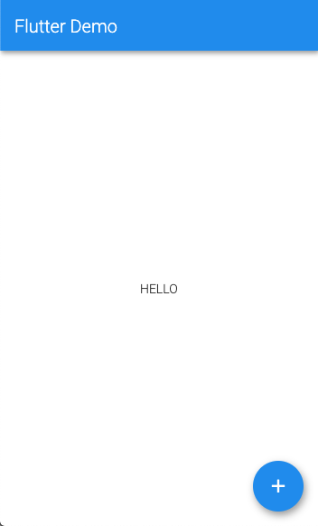
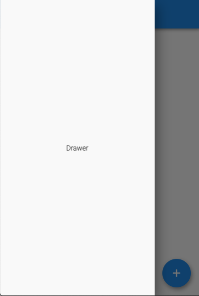
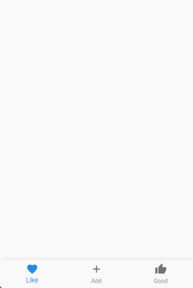
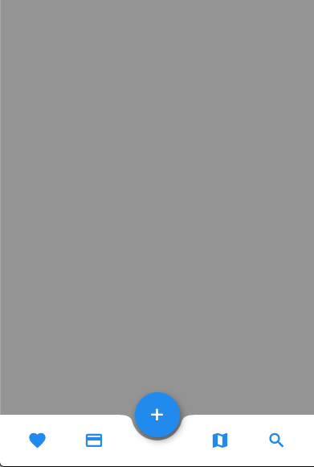
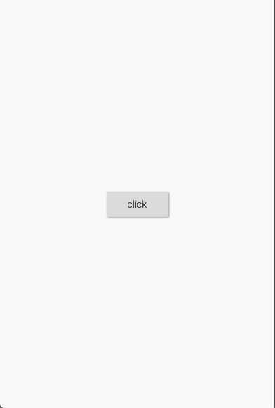
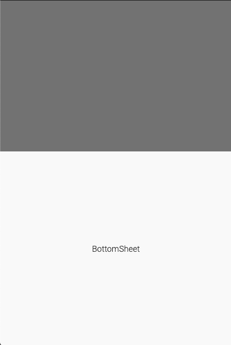

## 主な用途

各画面のベースとなるレイアウトを作るために用いるWidggetです。  
多くの場合、各画面で `Scaffold` を使うことになるでしょう。


## 基本的な使い方

`AppBar`, `FloatingActionButton`, `Drawer` など  
よく使われるUIは簡単に作れるようになっています。

```dart
Scaffold(
  // 上部にAppBarを表示
  appBar: AppBar(
    title: Text('Flutter Demo'),
  ),
  // 背景色
  backgroundColor: Colors.white,
  // メインコンテンツ
  body: Center(
    child: Text('HELLO'),
  ),
  // 右下に丸ボタン
  floatingActionButton: FloatingActionButton(
    child: Icon(Icons.add),
  ),
  // サイドナビ
  drawer: Drawer(
    child: Center(child: Text('Drawer')),
  ),
)
```

<table>
    <thead>
        <tr>
            <th>画面</th>
            <th>サイドナビ</th>
        </tr>
    </thead>
    <tbody>
        <tr>
            <td width="50%"></td>
            <td width="50%"></td>
        </tr>
    </tbody>
</table>


## フッターにナビゲーションボタン

フッターにナビゲーションボタンを表示することができます。  
FloatingActionButtonと組み合わせた少し凝ったUIも簡単に作れますね。

```dart
// 基本的なナビゲーション
Scaffold(
  bottomNavigationBar: BottomNavigationBar(
    items: [
      BottomNavigationBarItem(
        icon: Icon(Icons.favorite),
        title: Text('Like'),
      ),
      BottomNavigationBarItem(
        icon: Icon(Icons.add),
        title: Text('Add'),
      ),
      BottomNavigationBarItem(
        icon: Icon(Icons.thumb_up),
        title: Text('Good'),
      ),
    ],
  ),
)

// FABと組み合わせたナビゲーション
Scaffold(
  backgroundColor: Colors.grey,
  bottomNavigationBar: BottomAppBar(
    shape: CircularNotchedRectangle(),
    child: Container(
      height: 64,
      child: Row(
        mainAxisAlignment: MainAxisAlignment.spaceEvenly,
        children: <Widget>[
          IconButton(
            icon: Icon(Icons.favorite),
            color: Colors.blue,
            onPressed: () {},
          ),
          IconButton(
            icon: Icon(Icons.payment),
            color: Colors.blue,
            onPressed: () {},
          ),
          Container(width: 64),
          IconButton(
            icon: Icon(Icons.map),
            color: Colors.blue,
            onPressed: () {},
          ),
          IconButton(
            icon: Icon(Icons.search),
            color: Colors.blue,
            onPressed: () {},
          ),
        ],
      ),
    ),
  ),
  floatingActionButton: FloatingActionButton(child: Icon(Icons.add)),
  floatingActionButtonLocation: FloatingActionButtonLocation.centerDocked,
)
```

<table>
    <thead>
        <tr>
            <th>基本的なナビゲーション</th>
            <th>FABと組み合わせたナビゲーション</th>
        </tr>
    </thead>
    <tbody>
        <tr>
            <td width="50%"></td>
            <td width="50%"></td>
        </tr>
    </tbody>
</table>


## 下から出てくるボトムシート

画面の下から出てくるUIも作れるようになっています。

```dart
Scaffold(
  body: MyWidget(),
)

class MyWidget extends StatelessWidget {
  @override
  Widget build(BuildContext context) {
    return Center(
      child: RaisedButton(
        onPressed: () {
          showModalBottomSheet(
            context: context,
            builder: (context) => Center(child: Text('BottomSheet')),
          );
        },
        child: Text('click'),
      ),
    );
  }
}
```

<table>
    <thead>
        <tr>
            <th>表示前</th>
            <th>ボトムシート表示</th>
        </tr>
    </thead>
    <tbody>
        <tr>
            <td width="50%"></td>
            <td width="50%"></td>
        </tr>
    </tbody>
</table>


## Scaffoleを使ってみる

実際に使って試してみましょう。  
この他にも色々と機能はあるので、詳しくは公式ドキュメントを確認してみて下さい。

- https://api.flutter.dev/flutter/material/Scaffold-class.html

```run-dartpad
import 'package:flutter/material.dart';

void main() => runApp(MyApp());

class MyApp extends StatelessWidget {
  @override
  Widget build(BuildContext context) {
    return MaterialApp(
      title: 'Flutter Demo',
      theme: ThemeData(primarySwatch: Colors.blue),
      debugShowCheckedModeBanner: false,
      home: Scaffold(
        appBar: AppBar(
          title: Text('Flutter Demo'),
        ),
        backgroundColor: Colors.white,
        body: Center(
          child: Text('HELLO'),
        ),
        floatingActionButton: FloatingActionButton(
          child: Icon(Icons.add),
        ),
        drawer: Drawer(
          child: Center(child: Text('Drawer')),
        ),
      ),
    );
  }
}
```