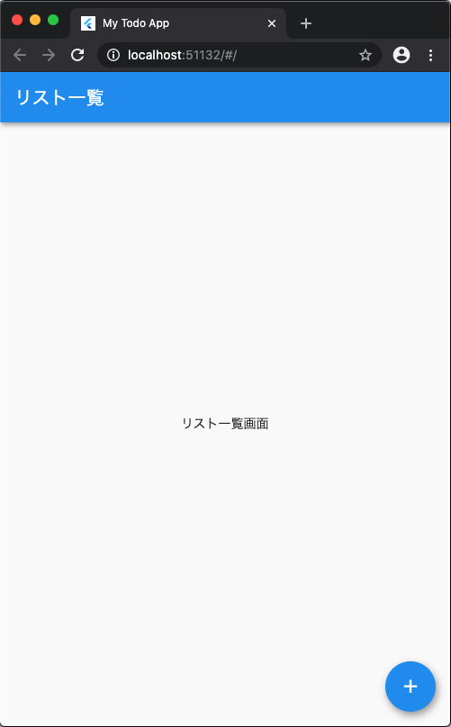
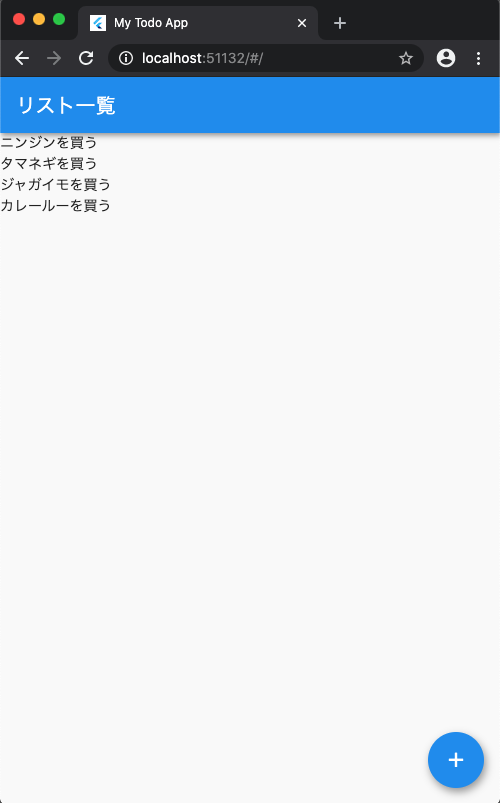
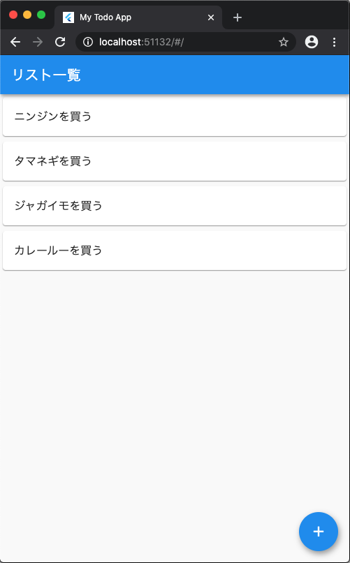

## このページのゴール

- Todoアプリのリスト一覧画面を作成する


## リスト一覧画面

### Todoアプリ全体像

前回作成したTodoアプリの雛形を元に、ここではリスト一覧画面を作っていきましょう 💪




### AppBarを表示する

まずは、[AppBarを表示](/widgets/app-bar)し、タイトルを `リスト一覧` としてみましょう。

`lib/main.dart` の `TodoListPage` Widget を以下のように書き換えましょう。

解説

- `AppBar` Widget を使いAppBarを表示

ソースコード

```dart
// リスト一覧画面用Widget
class TodoListPage extends StatelessWidget {
  @override
  Widget build(BuildContext context) {
    return Scaffold(
      // *** 追加する部分 ***
      // AppBarを表示し、タイトルも設定
      appBar: AppBar(
        title: Text('リスト一覧'),
      ),
      body: Center(
        child: Text('リスト一覧画面'),
      ),
      floatingActionButton: FloatingActionButton(
        onPressed: () {
          // --- 省略 ---
        },
        child: Icon(Icons.add),
      ),
    );
  }
}
```

この様に表示されていればOKです。




### リスト一覧を表示する

次は、Todoリスト一覧を表示してみましょう。  
[スクロール可能なリストを表示](/widgets/list-view-widget)したい時は `ListView` Widgetを使えばよかったですよね

`lib/main.dart` の `TodoListPage` Widget を以下のように書き換えましょう。

解説

- `ListView` Widgetを使いリスト一覧を表示

ソースコード

```dart
// リスト一覧画面用Widget
class TodoListPage extends StatelessWidget {
  @override
  Widget build(BuildContext context) {
    return Scaffold(
      // AppBarを表示し、タイトルも設定
      appBar: AppBar(
        title: Text('リスト一覧'),
      ),
      // *** 追加する部分 ***
      // ListViewを使いリスト一覧を表示
      body: ListView(
        children: <Widget>[
          Text('ニンジンを買う'),
          Text('タマネギを買う'),
          Text('ジャガイモを買う'),
          Text('カレールーを買う'),
        ],
      ),
      floatingActionButton: FloatingActionButton(
        onPressed: () {
          // --- 省略 ---
        },
        child: Icon(Icons.add),
      ),
    );
  }
}
```

この様に表示されていればOKです。




### リスト一覧のデザインを整える

せっかくなので、デザインも少し整えてみましょう ✨✨✨

[リスト表示の時は `ListTile` Widget と `Card` Widget を組み合わせる](/widgets/list-view-widget)ことで、  
簡単に整ったUIが作れましたよね

`lib/main.dart` の `TodoListPage` Widget を以下のように書き換えましょう。

解説

- リスト表示に適した`Card` Widget と`ListTile` Widget を使い、簡単に整ったUIを作成

ソースコード

```dart
// リスト一覧画面用Widget
class TodoListPage extends StatelessWidget {
  @override
  Widget build(BuildContext context) {
    return Scaffold(
      // AppBarを表示し、タイトルも設定
      appBar: AppBar(
        title: Text('リスト一覧'),
      ),
      // ListViewを使いリスト一覧を表示
      body: ListView(
        children: <Widget>[
          // *** 追加する部分 ***
          // CardとListTileを使い、簡単に整ったUIを作成
          Card(
            child: ListTile(
              title: Text('ニンジンを買う'),
            ),
          ),
          Card(
            child: ListTile(
              title: Text('タマネギを買う'),
            ),
          ),
          Card(
            child: ListTile(
              title: Text('ジャガイモを買う'),
            ),
          ),
          Card(
            child: ListTile(
              title: Text('カレールーを買う'),
            ),
          ),
        ],
      ),
      floatingActionButton: FloatingActionButton(
        onPressed: () {
          // --- 省略 ---
        },
        child: Icon(Icons.add),
      ),
    );
  }
}
```

この様に表示されていればOKです。




### リスト一覧画面が作成できました

お疲れさまでした 👏  
これでTodoアプリのリスト一覧を表示する部分が作成できました。

今までに紹介したWidgetをいくつか組み合わせて  
簡単に整ったUIを作成することができましたね 🤩

この後も、リスト一覧画面・リスト追加画面を作り込んでいくので頑張って行きましょう 💪


### ソースコード

<iframe
    width="100%"
    height="500px"
    src="https://dartpad.dev/embed-flutter.html?split=60&theme=dark&run=true&id=de96e62138561a8b572c1a82070d5f59">
</iframe>


## まとめ

- `ListView`を使いリスト一覧を表示できる
- `Card` と `ListTile` を組み合わせて簡単に整ったUIが作れる

次は、Todoリスト追加画面を作り込んでいきましょう 💪💪💪
