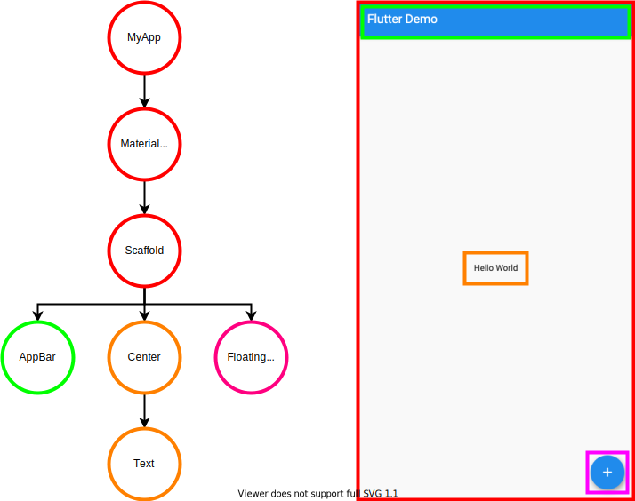

## このページのゴール

- Flutterではどの様にUIが構築されているかを知る


## Widget

Flutterの**UIを構築しているパーツ**のことを**Widget**と呼びます。  
様々なWidgetを組み合わせることで複雑なUIを構築しているのです。  

👇 のコードを例にどの様なWidgetが組み合わされているか見ていきましょう 💪

```dart
import 'package:flutter/material.dart';

void main() => runApp(MyApp());

class MyApp extends StatelessWidget {
  @override
  Widget build(BuildContext context) {
    return MaterialApp(
      title: 'Flutter Demo',
      debugShowCheckedModeBanner: false,
      theme: ThemeData(
        primarySwatch: Colors.blue,
      ),
      home: Scaffold(
        appBar: AppBar(
          title: Text('Flutter Demo'),
        ),
        body: Center(
          child: Text('Hello World'),
        ),
        floatingActionButton: FloatingActionButton(
          onPressed: () {},
          child: Icon(Icons.add),
        ),
      ),
    );
  }
}
```

`MyApp`, `MaterialApp`, `Scaffold`, `AppBar`, `Center`, `Text`, `FloatingActionButton` がWidgetです。  

- MyApp： 自分で作成したWidget
- MaterialApp： マテリアルデザイン用Widget
- Scaffold： マテリアルデザイン用Widget
- AppBar： アプリケーションバー用Widget
- Center： 中央寄せ用Widget
- Text： テキスト用Widget
- FloatingActionButton： アクションボタン用Widget

これらのWidgetは👇の様なツリー状に組み合わさっています。  



この様に、FlutterでUIを構築する際は**Widgetをツリー状に組み合わせ、様々なUIを実現**することができるのです 👀


## まとめ
- FlutterのUIはWidgetを組み合わせて構築されている

それでは、次からは実際に色々なWidgetを使ってみましょう 🤩
