## このページのゴール

- 状態を持ったWidgetの使い方を知る


## StatefulWidget・State

### データを元にUIを作る

ボタンを押したら表示する値を変更したりと、  
データを元にWidgetを表示したい場合があると思います。

そんな時は `StatefulWidget` と `State` を使えばOKです 👍

イメージとしては **データを元にUIを作る** 感じです。  
`State` にデータを持ち、それを元に `StatefulWidget` でUIを作るのです



少し難しい表現ですが、この様な仕組みを **状態を持つ** と言ったりします。


### 状態を持ったWidget

それでは、実際に `StatefulWidget` と `State` を使ってみましょう。

少し難しくはありますが、基本的には以下の2つを作ればOKです 👍

- `StatefulWidget` を継承したWidget
- `State` を継承したデータ

注意点としては、**データを更新する時は `setState` を使う**という所です。  
これを忘れてしまうと上手くWidgetが表示されないので気をつけましょう 👀

```dart
// StatefulWidgetを継承するとStateを扱える
// このWidgetを表示すると、Stateを元にUIが作成される
class MyWidget extends StatefulWidget {
  // 使用するStateを指定
  @override
  _MyWidgetState createState() => _MyWidgetState();
}

// Stateを継承して使う
class _MyWidgetState extends State<MyWidget> {
  // データを宣言
  int count = 0;

  // データを元にWidgetを作る
  @override
  Widget build(BuildContext context) {
    return Column(
      children: <Widget>[
        Text(count.toString()),
        RaisedButton(
          onPressed: () {
            // データを更新する時は setState を呼ぶ
            setState(() {
              // データを更新
              count = count + 1;
            });
          },
          child: Text('カウントアップ'),
        ),
      ],
    );
  }
}
```

### 使ってみる

実際に使ってみるとこんな感じになります。  
👇 色々と書き換えて動かしてみましょう 💪💪💪

<iframe
    width="100%"
    height="500px"
    src="https://dartpad.dev/embed-flutter.html?split=60&theme=dark&run=true&id=63ed3594075c455aa18ba367e44fc44f">
</iframe>

この他にも、色々と機能はあるので気になるときは公式ドキュメントを見てみましょう 👀

- https://flutter.dev/docs/development/ui/interactive


## まとめ

- データを元にWidgetを表示する時は `StatefulWidget` と `State` を使う。

色々なWidgetを使ってみて、何となくUIを作る方法のイメージがついたでしょうか 🤔  
次からは、実際に動きのある簡単なアプリケーションを作ってみましょう 💪💪💪


## 参考情報

- https://flutter.dev/docs/development/ui/interactive
